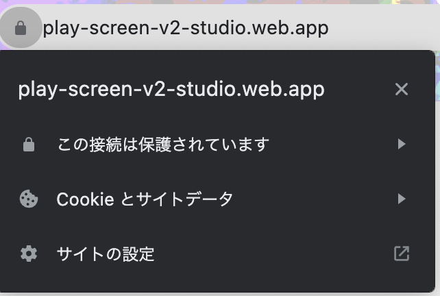
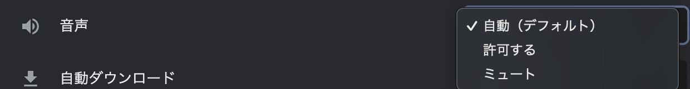

# よくある質問

キャラクターについて

PCやNPCは何人まで作成できるか

PC（プレイヤーキャラクター）は7人まで作成できます。\
NPCは理論上、無限です。

設定したミッションはプレイ中、どこから確認できるのか

ウズスタジオのキャラクター編集画面で設定したミッションは、**感想戦画面でのみ**表示されます。プレイ中のテキストタブ等に自動で表示されることはありませんので、プレイヤーにミッションを提示したい場合は**配布するテキスト内に文字情報として載せる**ようにしてください。

条件付きアイコンを設定しているが上手く変更されない

条件付きアイコンは上から順に優先です。フェーズ1で変更したいアイコンA、フェーズ2で変更したいアイコンB、フェーズ3で変更したいアイコンCがある場合、上からの並び順をアイコンC→B→Aにする必要があります。

2周目キャラクターにするにはどうすればいいですか

キャラクターをクリックした後に、プレイ条件:2周目+専用キャラクターにチェックを入れてください。\
詳しくは以下のリンクから確認してください。

[https://app.gitbook.com/o/g4uBD0iJkCwCG7OS3Op7/s/gOyErfAjeKrNXFgLBxtx/\~/changes/204/basic-features/character/second-play-character](https://app.gitbook.com/o/g4uBD0iJkCwCG7OS3Op7/s/gOyErfAjeKrNXFgLBxtx/~/changes/204/basic-features/character/second-play-character)

## フェーズについて 

分岐がある場合の遷移設定で、全てを条件遷移（青い線の分岐）にすることができないのなぜか？

条件遷移で全ての可能性を網羅できていない場合、プレイヤーの選択によっては行きつくフェーズがない状態が発生し、**進行不能**になってしまいます。そういった状況に陥るのを防ぐため、必ず１つは「条件遷移で設定されていない残り全て」に対応する**基本遷移**（黒い線の分岐）になるようにしてあります。

同票のときとそうでないときで分岐を分けられるか？

同票でも最多と見なす「**同票最多**」、単独トップのときのみ最多と見なす「**単独最多**」という条件が設定できます。

例えば、４人シナリオで２対２となっていても２人が犯人に投票できていれば正答エンドに遷移させたい場合は「**同票最多**」を、２：１：１か３：１で犯人が最多である場合しか認めたくない場合は「**単独最多**」を使うと良いでしょう。

読み合わせフェーズに画像を入れられるか

セリフボックスの横にある6つの点が並んでいるマークをクリックし、「画像に変換」を選択すると、画像が挿入できるようになります。

## テキストについて

特定のフェーズ以降、読み返せなくなるようなテキストを配布したい

テキストの配布条件で「特定のフェーズにいる時のみ」を設定してください。

別の画面に移動してから戻ってくると、入力したはずのテキストが消えている

反映が遅れているだけの可能性が高いため、一度リロード「Ctrl + R」「Command + R」をお試しください。

数字以外が斜体にならない

エディター画面では斜体が反映されません。動作確認やアプリ上では反映されています。

文字の色を変更したが反映されない

もともと黒以外の文字色にしていたテキストの色を別の色で上書きした場合は、エディター画面で即時反映されません。一度リロード「Ctrl + R」「Command + R」をしていただくと反映されます。

画像がアップロードできない

4.5MB以上の画像はアップロードできません。サイズの圧縮をしてからアップロードしてください。\
4.5MB未満であるがアップロードできていないように見える場合は、リロード「Ctrl + R」「Command + R」をお試しください。\
それでも反映されない場合は、運営チームにお問い合わせください。

動作確認・テストプレイで「エラーが発生しました」と出る

画像のようなエラーの場合、何も書かれていないテキストボックスがあるのが原因です。ウズスタジオのエディター画面から該当のテキストボックスを削除すると、次の動作確認（テストプレイ）から直ります。

## 手がかりについて

ある一つの手がかりに関して、見る人によって表示する内容を変えることはできるか

可能です。[こちらのページ](advanced/text-customize.md)をご参照ください。

一度配布した手がかりを特定のタイミングから非表示にしたい

[手がかりの回収](packages/ja/basic-features/clue.md#hui-shou-tiao-jian-ren-yi)機能をご利用ください。

## ルームについて

まだ質問はありません。

## 感想戦画面について

感想戦画面に何を書けばいいのか分からない

推理を必要とするシナリオの場合は、必ず真相とその解説をするタブを追加してください。解説として、どのような内容を書けばいいのか分からない方は、公式Discordサーバー内の「編集部記事」チャンネルから「解説テキストの書き方・コツ」という記事をご参照ください。

感想戦画面に置いたリンクがクリック/タップしても反応しなかった

アプリの実際の画面上でリンクをタップした際、問題なく遷移できる/遷移できない/アプリが落ちるなど、端末や環境によって動作が異なるため、リンクの新規設置はできないようになっています。単にURLの文字列を表示することや二次元コードの画像を設置することは可能です。

過去に設置したリンクについて\
動作確認ではクリックしても反応しないようになっています。

## 演出について 

フェーズの途中でBGMを切り替えたい

読み合わせフェーズであれば可能です。[演出](packages/ja/basic-features/effect/)で方法を説明していますので、ご参照ください。

どうしてもアップロードできないBGMがある

1分あたり2MBを超えるBGMはアップロードできません。「mp3 圧縮」等で検索すると、サイズ容量を小さくできるサイトが見つかりますので、1分あたり2MB未満にしてからアップロードしてください。

BGMの音量が大きすぎる

Audacityなどのアプリや音量調整のできるサイトを利用して音量を調整してからアップロードする、ウズスタジオ内の音量調整ボタンから調整する　のいずれかをお願いいたします。

実際にアプリ内で聞こえる音量は、スマートフォンでウズスタジオにアクセス→イヤホンをつけてBGMを再生してみる　で確認できます。

## ゲームの流れについて

フェーズで設定している制限時間と異なる時間がゲームの流れに表示される

フェーズの編集画面で設定するタイマーとは別で、[ゲームの流れ](QandA.md#gmunorenitsuite)の編集画面でも制限時間を入力する必要があります。フェーズの編集画面で設定した制限時間と同じ時間をゲームの流れの編集画面に入力すれば、不一致が解消されます。

## その他

ログイン情報が合っているはずなのに「権限が不足しています。」と表示される

自作シナリオのはずであるのに、以下のような「シナリオが見つかりませんでした〜」となる場合の対処法です。

以下の操作を行なってください。

**①「権限が不足しています。」の画面からログアウトする**

左下の黒いはてなアイコンをタップして、ログアウトを行います。

 (1) (1) (1) (1) (1) (1).png>)

**②ログイン画面に遷移するので、普段お使いのウズアカウントのログイン方法でログインする**

この方法でログインし直しても同様の症状になる方は、運営にお問い合わせください。

「このアカウントはウズに連携していません」という画面になった

画面に表示されているログアウトをクリックし、もう一度ログインしてください。再ログインで解消しない場合は、運営チームにお問い合わせください。

シナリオの中身が消えたように見える

読み込みが間に合ってないだけの場合が多いです。リロード「Ctrl + R」「Command + R」、あるいは、時間を置いてから再度確認してください。解消しない場合は、運営チームにお問い合わせください。

Application errorと表示された

複数の操作を連続で行ったために、読み込みが間に合ってない可能性があります。リロード「Ctrl + R」「Command + R」、あるいは、時間を置いてから再度確認してください。解消しない場合は、運営チームにお問い合わせください。

動作確認やアプリに反映のエラーで「undefinedのフェーズ」と出てくる

こちらで処理が必要ですので、運営チームにご連絡ください。

動作確認で、最初のフェーズから再生されるように設定した音声が再生されない

Google Chromeでは、最初のフェーズから再生されるように設定した音声は再生されません。アプリ側では問題なく再生されます。 対処法としては、以下の2つのうちどちらかをお試しください。\
1\. 他のブラウザ(Safariなど)で試す\
2\. Google ChromeのautoPlayポリシーの設定を変更する。\\

autoPlay ポリシーの設定変更の方法は以下の通りです。\\

1. 動作確認画面の URL バーの鍵マークをクリック →「サイトの設定」をクリック\
   \\
2. 「音声」の項目で「自動(デフォルト)」をクリック →「許可する」に変更\
   \\

共同編集者の追加方法は？

シナリオホーム画面の「[メンバー](packages/ja/scenariohome/author.md)」から行います。追加をクリックし、共同編集者の**ウズのユーザー ID**を入力してください。

アプリ「ウズ」のサイドメニューに「作家ページ」が表示されない

ウズスタジオにログイン後、１つ以上シナリオを作成すると表示されるようになります。

詳しくは[こちら](packages/ja/top/profile.md#pjibotan)をご参照ください。

このサイトにアクセスできません/ERR_CONNECTIN_CLOSEDと表示される

お使いのWi-Fiによる一時的なセキュリティ制限が原因であることが多いです。丸１日以上経過すると改善されるという報告があります。

お急ぎの場合は、スマートフォンからのテザリングやスマートフォン4G/5Gであればアクセスできるはずです。

アップロードできる画像・動画の種類が知りたい

ウズスタジオでは以下の画像・動画のフォーマットをサポートしています。

#### 画像&#x20;

PNG(アニメーションPNGを除く), GIF, JPEG, WebP, SVG

※アップロードできる最大ファイルサイズは4.5MBです。

#### 音声

MP3

※アップロードできる最大ファイルサイズは再生時間1分あたり2MBです。

#### 動画

MP4

※アップロードできる最大ファイルサイズは10MBです

推奨環境が知りたい

#### Windows

OS: Windows11以降

ブラウザ: Google Chrome最新版, Microsoft Edge最新版

#### Mac

OS: macOS Sonoma 14 以降

ブラウザ: Google Chrome最新版、Safari最新版

### 推奨はしてないがサポートしている環境

#### **Android**

OS: Android 12以降

ブラウザ: Google Chrome最新版

#### **IOS**

OS: IOS 18以降

ブラウザ: Google Chrome最新版、Safari最新版

※上記以外の環境でも動作はしますが、画面崩れや予期せぬ不具合が発生する場合がございます。

※また、スマートフォン環境ではシナリオの動作確認をWeb上で行うことはできません。

