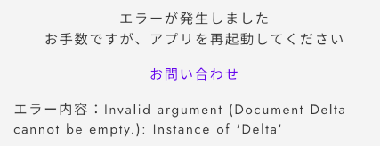

# よくある質問：v2

## キャラクターについて

PCやNPCは何人まで作成できるか

PC（プレイヤーキャラクター）は7人まで作成できます。\
NPCは理論上、無限です。

設定したミッションはプレイ中、どこから確認できるのか

ウズスタジオのキャラクター編集画面で設定したミッションは、**感想戦画面でのみ**表示されます。プレイ中のテキストタブ等に自動で表示されることはありませんので、プレイヤーにミッションを提示したい場合は**配布するテキスト内に文字情報として載せる**ようにしてください。

\

## フェーズについて 

分岐がある場合の遷移設定で、全てを条件遷移（黒地に白文字）にすることができないのなぜか？

条件遷移で全ての可能性を網羅できていない場合、プレイヤーの選択によっては行きつくフェーズがない状態が発生し、**進行不能**になってしまいます。そういった状況に陥るのを防ぐため、必ず１つは「条件遷移で設定されてない残り全て」に対応する**基本遷移**（白地に黒文字）になるようにしてあります。

同票のときとそうでないときで分岐を分けられるか？

同票でも最多と見なす「**同票最多**」、単独トップのときのみ最多と見なす「**単独最多**」という条件が設定できます。

例えば、４人シナリオで２対２となっていても２人が犯人に投票できていれば正答エンドに遷移させたい場合は「**同票最多**」を、２：１：１か３：１で犯人が最多である場合しか認めたくない場合は「**単独最多**」を使うと良いでしょう。

読み合わせフェーズに画像を入れられるか

セリフボックスの横にある6つの点が並んでいるマークをクリックし、「画像に変換」を選択すると、画像が挿入できるようになります。

\

## テキストについて

特定のフェーズ以降、読み返せなくなるようなテキストを配布したい

テキストの配布条件で「特定のフェーズにいる時のみ」を設定してください。

別の画面に移動してから戻ってくると、入力したはずのテキストが消えている

反映が遅れているだけの可能性が高いため、一度リロード「Ctrl + R」「Command + R」をお試しください。

数字以外が斜体にならない

エディター画面では斜体が反映されません。動作確認やアプリ上では反映されています。

文字の色を変更したが反映されない

もともと黒以外の文字色にしていたテキストの色を別の色で上書きした場合は、エディター画面で即時反映されません。一度リロード「Ctrl + R」「Command + R」をしていただくと反映されます。

画像がアップロードできない

4.5MB以上の画像はアップロードできません。サイズの圧縮をしてからアップロードしてください。\
4.5MB未満であるがアップロードできていないように見える場合は、リロード「Ctrl + R」「Command + R」をお試しください。\
それでも反映されない場合は、運営チームにお問い合わせください。

動作確認・テストプレイで「エラーが発生しました」と出る

画像のようなエラーの場合、何も書かれていないテキストボックスがあるのが原因です。ウズスタジオのエディター画面から該当のテキストボックスを削除すると、次の動作確認（テストプレイ）から直ります。

\

## 手がかりについて

ある一つの手がかりに関して、見る人によって表示する内容を変えることはできるか

現在はできません。同じ名前の手がかりを複数作成し、配布対象や内容を変えておくことで近い演出は可能です。

一度配布した手がかりを特定のタイミングから非表示にしたい

一度配布した手がかりを所有者の手元から消すような設定はできません。特定のタイミング以降で読み返せないような情報を配布したい場合は、テキストをご利用ください。

\

## ルームについて

まだ質問はありません。

\

## 感想戦画面について

感想戦画面に何を書けばいいのか分からない

推理を必要とするシナリオの場合は、必ず真相とその解説をするタブを追加してください。解説として、どのような内容を書けばいいのか分からない方は、公式Discordサーバー内の「編集部記事」チャンネルから「解説テキストの書き方・コツ」という記事をご参照ください。

\

## 演出について 

フェーズの途中でBGMを切り替えたい

読み合わせフェーズであれば可能です。[演出](basic-features/bgm.md)で方法を説明していますので、ご参照ください。

どうしてもアップロードできないBGMがある

4.5MBを超えるBGMはアップロードできません。「mp3 圧縮」等で検索すると、サイズ容量を小さくできるサイトが見つかりますので、4.5MB未満にしてからアップロードしてください。

BGMの音量が大きすぎる

ご自身で音量を調整してからアップロードする必要があります。Audacityなどのアプリや音量調整のできるサイトをご利用ください。

背景画像はどこから設定するのか

現在は背景画像の設定ができません。近いうちに機能追加される予定です。

\

## ゲームの流れについて

フェーズで設定している制限時間と異なる時間がゲームの流れに表示される

フェーズの編集画面で設定するタイマーとは別で、[ゲームの流れ](QandA.md#gmunorenitsuite)の編集画面でも制限時間を入力する必要があります。フェーズの編集画面で設定した制限時間と同じ時間をゲームの流れの編集画面に入力すれば、不一致が解消されます。

\

## その他

「シナリオが見つかりませんでした〜」と表示される

自作シナリオのはずであるのに、以下のような「シナリオが見つかりませんでした〜」となる場合の対処法です。

 (1).png>)

### &#x20;V1から移行したシナリオの場合

v1シナリオをv2のウズスタジオで使用する場合、移行処理が必要です。

[v1noshinariowov2nisuru.md](others/v1noshinariowov2nisuru.md "mention") を行なってください。

### V2シナリオの場合

ログインが正常にできていない可能性が高いので、以下の操作を行なってください。

#### ①「シナリオが見つかりませんでした〜」の画面からログアウトする

PCでウズスタジオにアクセスしている方は左下のログアウトボタン、スマートフォンの方はヘッダー一番右のドアアイコンのボタンからログアウトを行います。

* PCの方

.png>)

* スマートフォンの方

#### ②ログイン画面に遷移するので、普段お使いのウズアカウントのログイン方法でログインする

.png>)

この方法でログインし直しても同様の症状になる方は、運営にお問い合わせください。

「このアカウントはウズに連携していません」という画面になった

画面に表示されているログアウトをクリックし、もう一度ログインしてください。再ログインで解消しない場合は、運営チームにお問い合わせください。

シナリオの中身が消えたように見える

読み込みが間に合ってないだけの場合が多いです。リロード「Ctrl + R」「Command + R」、あるいは、時間を置いてから再度確認してください。解消しない場合は、運営チームにお問い合わせください。

Application errorと表示された

複数の操作を連続で行ったために、読み込みが間に合ってない可能性があります。リロード「Ctrl + R」「Command + R」、あるいは、時間を置いてから再度確認してください。解消しない場合は、運営チームにお問い合わせください。

動作確認やアプリに反映のエラーで「undefinedのフェーズ」と出てくる

こちらで処理が必要ですので、運営チームにご連絡ください。

動作確認で、最初のフェーズから再生されるように設定した音声が再生されない

Google Chromeでは、最初のフェーズから再生されるように設定した音声は再生されません。アプリ側では問題なく再生されます。 対処法としては、以下の2つのうちどちらかをお試しください。\
1\. 他のブラウザ(Safariなど)で試す\
2\. Google ChromeのautoPlayポリシーの設定を変更する。\

autoPlay ポリシーの設定変更の方法は以下の通りです。\

1. 動作確認画面の URL バーの鍵マークをクリック →「サイトの設定」をクリック\
   \

2. 「音声」の項目で「自動(デフォルト)」をクリック →「許可する」に変更\
   \

共同編集者の追加方法は？

シナリオホーム画面の「[メンバー](scenariohome/author.md)」から行います。追加をクリックし、共同編集者の**ウズのユーザー ID**を入力してください。

