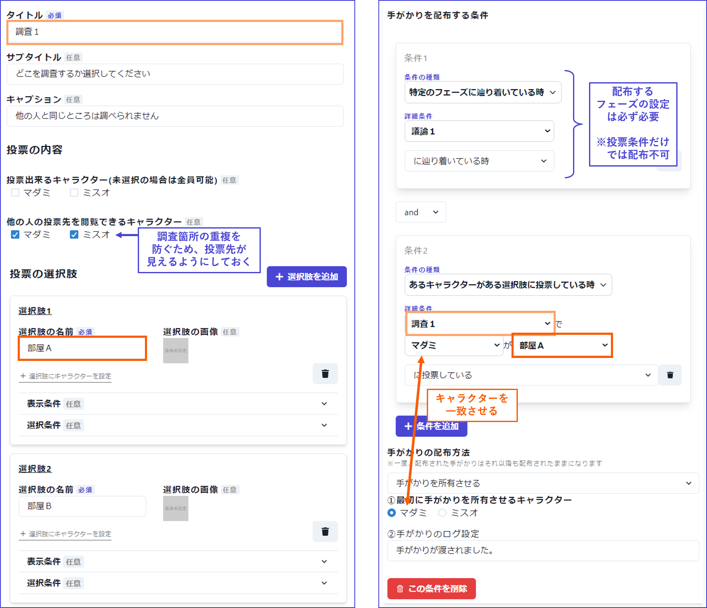
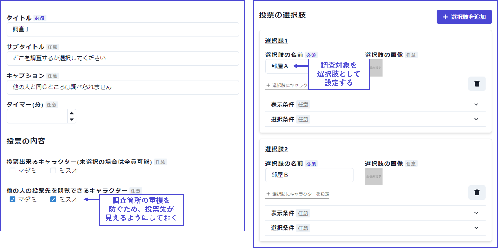
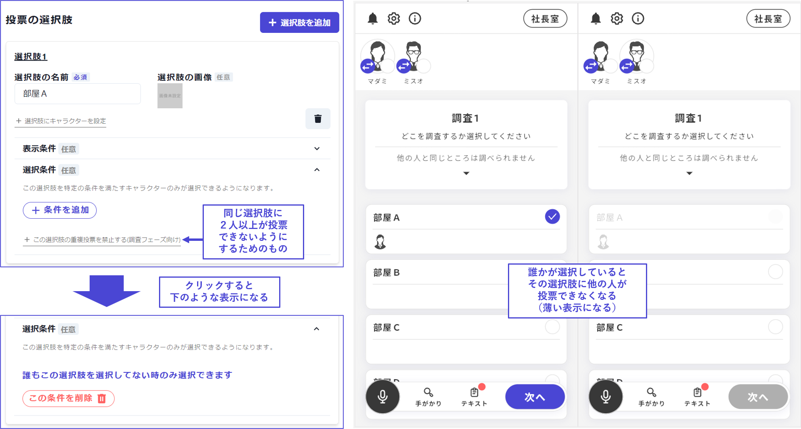

## 調査フェーズを組み込みたい

投票フェーズと手がかり配布を組み合わせることで、調査フェーズを実現することができます。

 

### ①フェーズの作成

フェーズ一覧から「フェーズを追加」をクリックし、「投票」フェーズを選択します。

作成した投票フェーズ内に、調査箇所の選択肢を設定します。

複数のプレイヤーが同じ場所を調査してしまうと、得られる手がかりが減ってしまうため、それぞれがどこに投票したのか閲覧できる設定にしておくのがよいでしょう。

 

また、「選択条件」の「この選択肢の重複投票を禁止する」をクリックすると、同じ選択肢に2人以上が投票できないようにすることができます。1人1つずつ、被りなく調査してもらいたい場合に有効です。

プレイ中の画面では、誰かが選んだ選択肢は他の人の画面で薄く表示されます。

※現在、「この選択肢の重複投票を禁止する」を他の条件とandやorで繋ぐことはできません。

 

### ②手がかりの作成

手がかり一覧から「新規追加」をクリックし、①で設定した調査箇所に対応する手がかりを作成します。

手がかりの配布設定を全員分、以下のように組みます。

| 項目                 | 内容                           | 詳細             |
| -------------------- | ----------------------------- | ------------------------------------- |
| 条件１（必要な場合）    | 特定のフェーズに辿り着いている時 | 手がかりを配布するフェーズです。 連続する投票フェーズのうち一番最後のフェーズや議論フェーズがよいでしょう。 |
| 条件２   | あるキャラクターがある選択肢に投票している時 | ①で作成した投票フェーズにて、あるキャラクターが該当する調査箇所に投票しているという条件を設定します。    |
| 手がかりの配布方法　　   | 手がかりを所有させる  | －       |
| 最初に手がかりを所有させるキャラクター       | キャラクターを選択  | 条件２のキャラクターと一致させます。 |
| 手がかりのログ設定 | － | 自由に決めてください。   | 

 

譲渡・見せる・全体公開などの条件は「特定のフェーズに辿り着いている時」で議論フェーズを指定しておくとよいでしょう。

