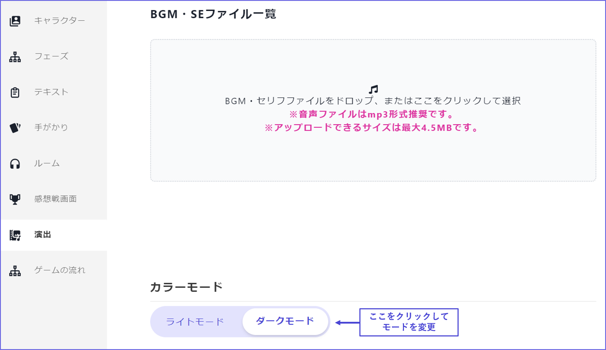

## 演出

演出では、主にBGM・SEとモードを設定します。

 

## BGM・SEについて

### BGM の設定

BGM をアップロードしたら、音声が始まるタイミングと止まるタイミングを設定します。

それぞれの意味は以下の通りです。

| 項目                             | 意味                                         |
| -------------------------------- | -------------------------------------------- |
| 音声が始まるフェーズまたはセリフ | 設定したフェーズまたはセリフの最初から流れる |
| 音声が止まるフェーズまたはセリフ | 設定したフェーズまたはセリフの直前に止まる   |

 

実際の設定イメージを示します。

ある BGM の「止まるタイミング」として設定したフェーズが、別の BGM の「始まるタイミング」として設定されているようにすれば、BGM が途切れずに再生されます。

 

### 読み合わせフェーズの途中で BGM を変える

v2 では、読み合わせフェーズの途中で BGM を変えることができます。

 

① まず、読み合わせフェーズ内で、BGM を変えるタイミングにしたいセリフを探します。

② そのセリフで「演出を追加」をクリックします。

③ キューが追加されるので、その名前を覚えておきます（分かりやすい名前に変更することもできます）。

④ 演出画面の「音声が始まるフェーズまたはセリフ」で ③ のキューを設定します。

 

### SE の設定

① 演出画面に SE（効果音）をアップロードします。

② デフォルトでは BGM になっているので、SE に変更します。

③SE を設定したいフェーズに行きます。

④SE を設定したいセリフで「演出を追加」をクリックします。

⑤SE を選択します。

 

## モードについて

演出画面の最下部でライトモード／ダークモードの設定ができます。

ライトモードは白地に黒字が基調、ダークモードは黒地に白字が基調です。シナリオの雰囲気に合わせて設定してください。

シナリオの途中でライトモード／ダークモードを切り替える仕様については、将来的に機能追加される予定です。

 

文字色は自動で最適化されるので、モードに合わせて変える必要はありません。

 

## よくある質問

演出についてのよくある質問は[こちら](../QandA.md#bgm-se)
