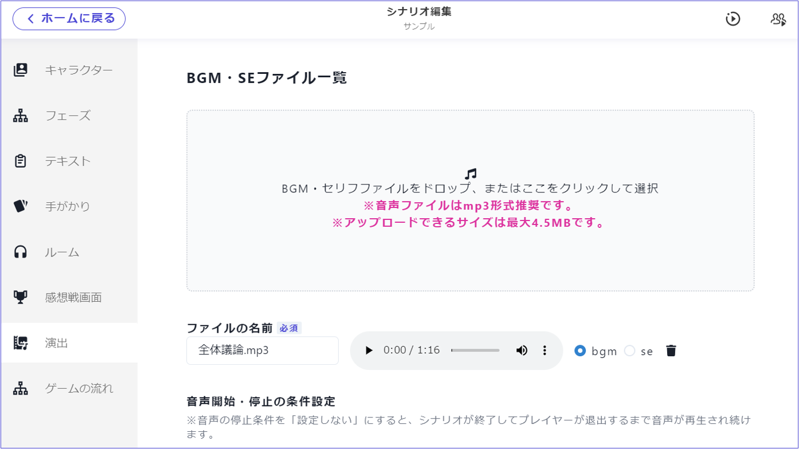
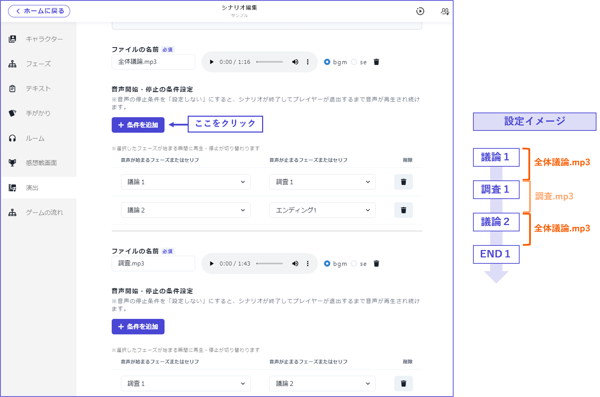
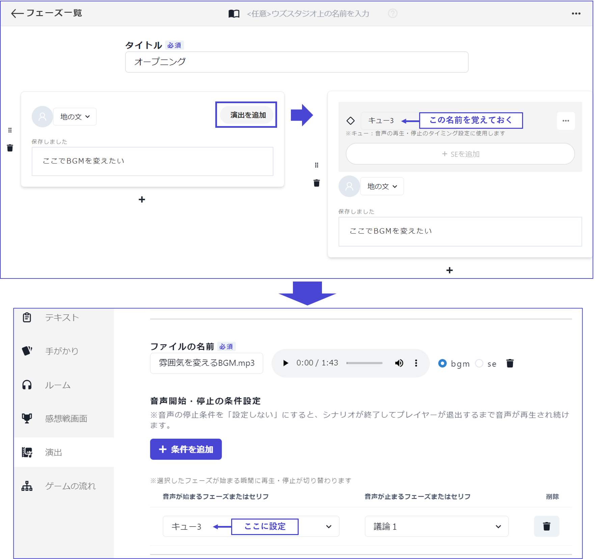
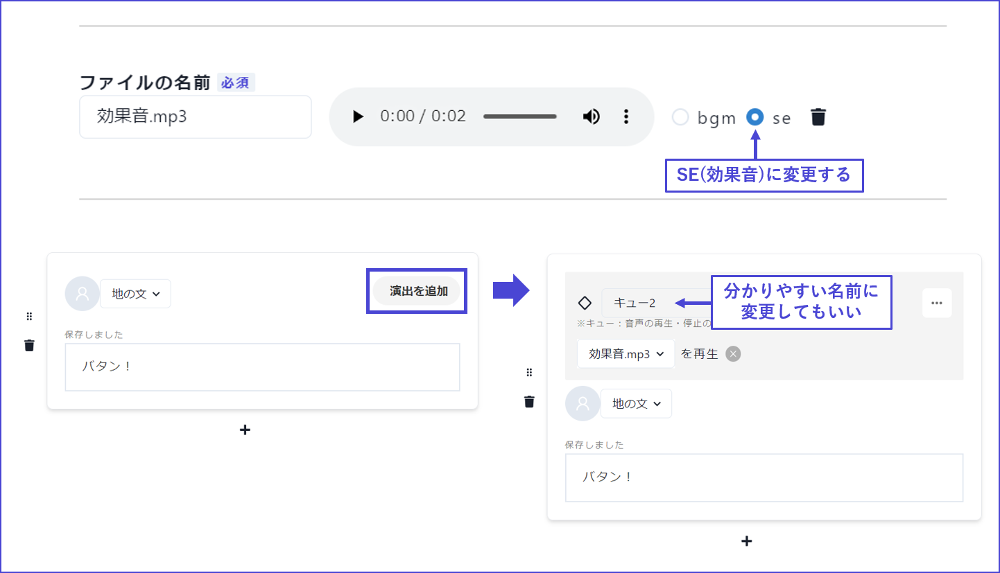
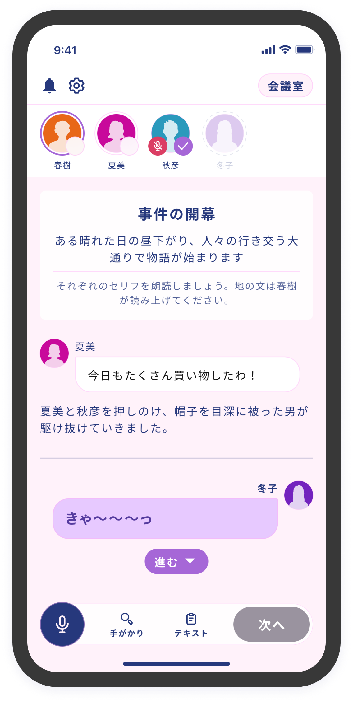
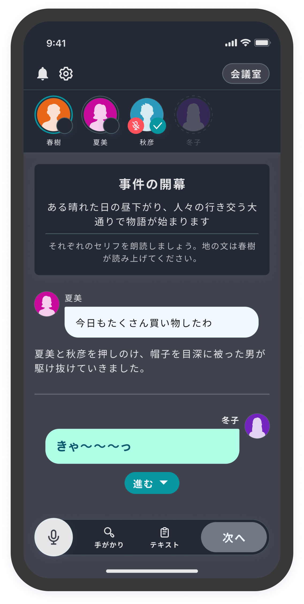

# 演出

### 演出

演出では、主にBGM・SEとカラーテーマを設定します。

\

### BGM・SEについて

#### BGM の設定

BGM をアップロードしたら、音声が始まるタイミングと止まるタイミングを設定します。

それぞれの意味は以下の通りです。

| 項目               | 意味                     |
| ---------------- | ---------------------- |
| 音声が始まるフェーズまたはセリフ | 設定したフェーズまたはセリフの最初から流れる |
| 音声が止まるフェーズまたはセリフ | 設定したフェーズまたはセリフの直前に止まる  |

\

実際の設定イメージを示します。

ある BGM の「止まるタイミング」として設定したフェーズが、別の BGM の「始まるタイミング」として設定されているようにすれば、BGM が途切れずに再生されます。

\

#### 読み合わせフェーズの途中で BGM を変える

v2 では、読み合わせフェーズの途中で BGM を変えることができます。

\

① まず、読み合わせフェーズ内で、BGM を変えるタイミングにしたいセリフを探します。

② そのセリフで「演出を追加」をクリックします。

③ キューが追加されるので、その名前を覚えておきます（分かりやすい名前に変更することもできます）。

④ 演出画面の「音声が始まるフェーズまたはセリフ」で ③ のキューを設定します。

\

#### SE の設定

① 演出画面に SE（効果音）をアップロードします。

② デフォルトでは BGM になっているので、SE に変更します。

③SE を設定したいフェーズに行きます。

④SE を設定したいセリフで「演出を追加」をクリックします。

⑤SE を選択します。

\

### カラーテーマについて

カラーテーマページからカラーテーマの設定ができます。

<figure><figcaption></figcaption></figure>

<figure><figcaption></figcaption></figure>

テーマは2024/01/12 現在で以下の種類が使用できます。

<table data-view="cards"><thead><tr><th></th><th></th><th></th></tr></thead><tbody><tr><td><strong>ライト</strong></td><td></td><td></td></tr><tr><td><strong>ダーク</strong></td><td></td><td></td></tr><tr><td><strong>マリン</strong></td><td></td><td></td></tr><tr><td><strong>アンティーク</strong></td><td></td><td></td></tr><tr><td><strong>ドリーム</strong></td><td></td><td></td></tr><tr><td><strong>モダン</strong></td><td></td><td></td></tr><tr><td><strong>メカニカル</strong></td><td></td><td></td></tr><tr><td><strong>ノスタルジア</strong></td><td></td><td></td></tr><tr><td><strong>サイバーパンク</strong></td><td></td><td></td></tr></tbody></table>

シナリオの途中でカラーテーマを切り替えるようになる機能は将来的に実装予定です。

\

文字色は自動で最適化されるので、モードに合わせて変える必要はありません。

\

### よくある質問

演出についてのよくある質問は[こちら](../QandA.md#bgm-se)
