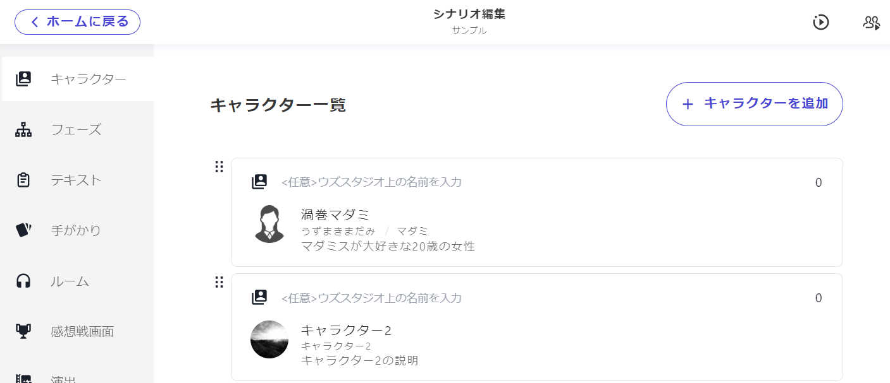
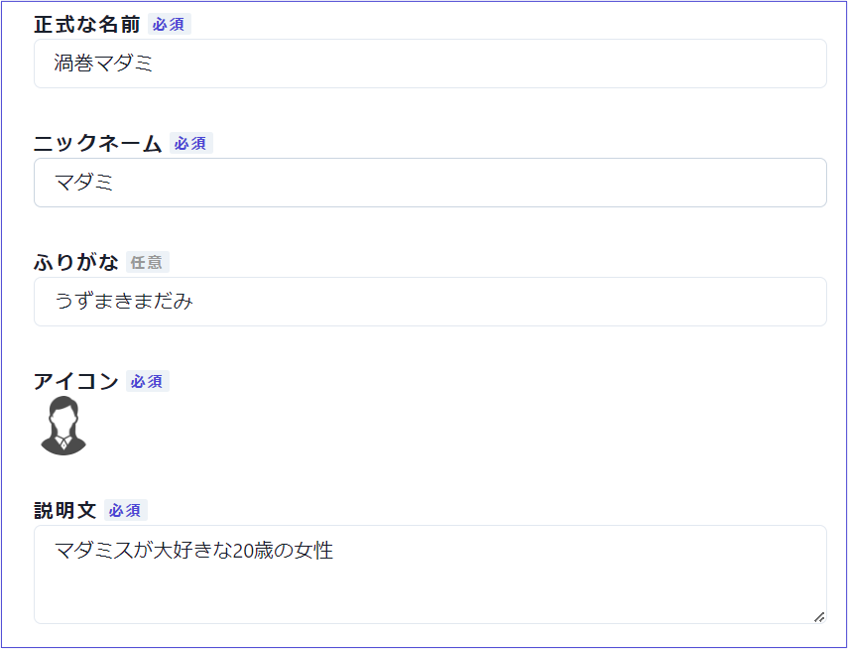

## キャラクターの基本項目

キャラクター基本情報の設定について説明します。

キャラクターの基本項目は以下の通りです。

| 項目                 | 内容                                                                                                                    | ウズアプリで表示される場所             |
| -------------------- | ----------------------------------------------------------------------------------------------------------------------- | -------------------------------------- |
| 正式な名前(必須)     | フルネームなど | シナリオ詳細画面・プレイ中画面の登場人物紹介 |
| ニックネーム(必須)   | 姓のみ・名前のみなどプレイ中に呼んでほしいもの | プレイ中の画面上部キャラクターアイコンの下     |
| ふりがな(任意)　　   | 正式な名前のふりがな  | プレイ中画面の登場人物紹介       |
| アイコン(必須)       | キャラクター画像  | 登場人物紹介や読み合わせのアイコン |
| 説明文(必須) | キャラクターの紹介文 | シナリオ詳細画面・プレイ中画面の登場人物紹介   | 

