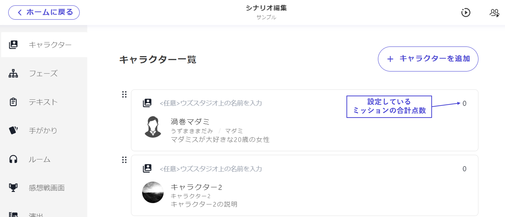

## キャラクターのミッション(任意)

ウズスタジオv2では、自動判定されるミッションを各キャラクターに設定することができます。

ミッションを設定したい場合はまず「＋」ボタンからミッションタブを追加します。

 

「タイトル」には「ミッションの内容」を記入します。
「達成条件」は自由に設定できます。

 

例
- 推理ミッションの場合：あるキャラクターがある選択肢（犯人）に投票しているとき
- 収集ミッションの場合：あるキャラクターがある手がかりを持っているとき
- 選択に関わるミッションの場合：あるエンディングに到達しているとき

 

設定したミッションは感想戦画面でのみ表示されます。各キャラクターのテキストタブ等に自動でミッション内容が配布されることはありませんので、プレイ途中で明かされるミッションも同じように設定しておいて問題ありません。

 

ミッションにはそれぞれ点数をつけることができます。点数の合計はキャラクター一覧画面に表示され、他のキャラクターとのバランスを確認できます。

