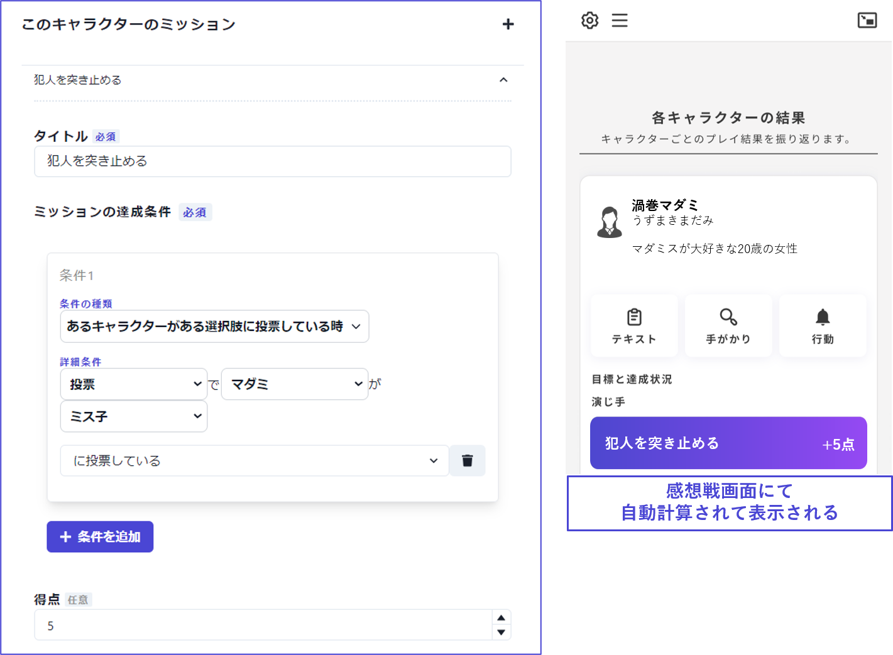

## キャラクターのミッション(任意)

ウズスタジオv2では、自動判定される**ミッション**を各キャラクターに設定することができます。

ミッションを設定したい場合はまず「＋」ボタンからミッションタブを追加します。
 

「タイトル」には「ミッションの内容」を記入します。
「達成条件」は自由に設定できます。
 

例
- 推理ミッションの場合：あるキャラクターがある**選択肢**（犯人）に投票しているとき
- 収集ミッションの場合：あるキャラクターがある**手がかり**を持っているとき
- 選択に関わるミッションの場合：ある**エンディング**に到達しているとき
 

設定したミッションは**感想戦画面でのみ**表示されます。各キャラクターの**テキストタブ等に自動でミッション内容が配布されることはありません**ので、プレイ途中で明かされるミッションも同じように設定しておいて問題ありません。

逆に言うと、ミッション内容は配布テキスト内で文字として書いておかなければ、プレイヤーには伝わらないため注意してください。

 

ミッションにはそれぞれ**点数**をつけることができます。**点数の合計**はキャラクター一覧画面に表示され、他のキャラクターとのバランスを確認できます。

点数配分を0点にしているミッションは、達成/未達成として、感想戦画面にて点数表記なしで表示されます。

