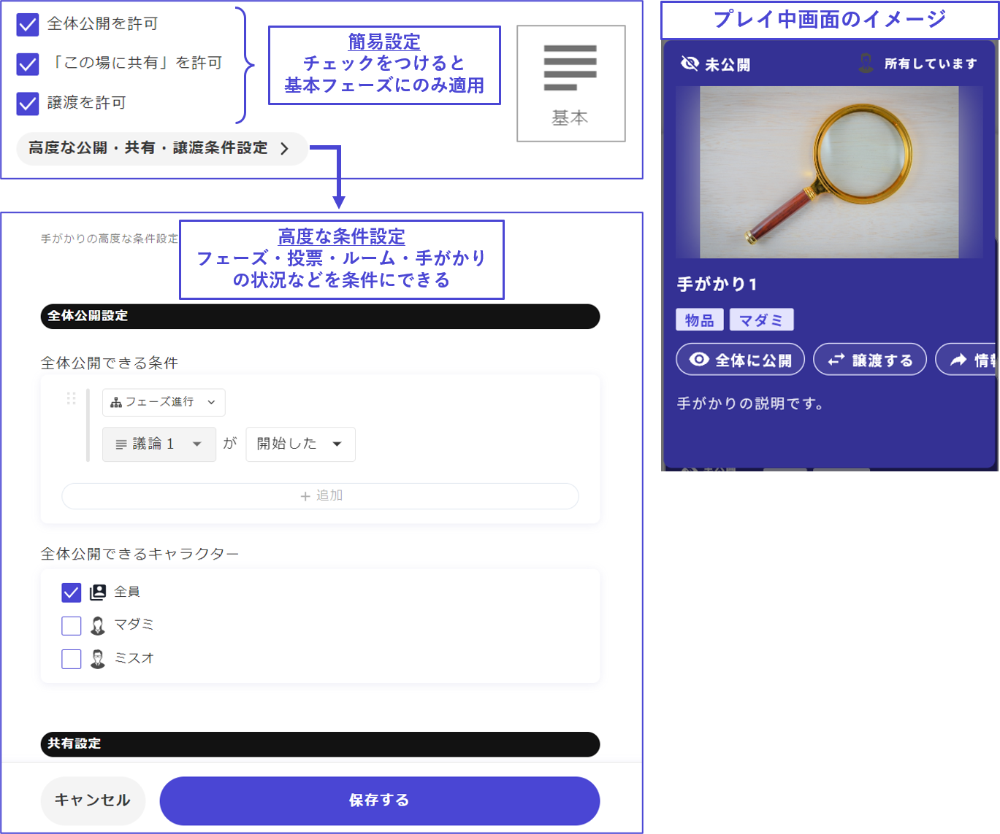

## 手がかり

手がかりでは、ゲーム中にやり取りする手がかりの設定や編集ができます。

 

### 基本項目

手がかりの基本項目は、プレイ中画面の**手がかり一覧**と**手がかり詳細**に表示されます。

対応は以下の通りです。

 

**タグ**はプレイ中に実行できる絞り込み検索にも関係しています。

 

**未公開の手がかりの存在を所有者以外の手がかり一覧画面に表示するかどうか**も設定できます。この設定をONにすると、所有者以外からも、その人が何らかの手がかりを持っていることが分かるようになります。

所有者以外の画面に表示されるのは「非公開時のタイトル」と「タグ」だけであり、手がかりの詳細は開示されません。

 

**手がかりの数の表示について**

「公開されている手がかり」と「未公開時の表示設定がONになっている手がかり」、すなわち、その人の画面上で存在が明らかとなっている手がかりのみがカウントされます。

 

### 配布条件（必須）

配布条件は右上の「＋追加」ボタンから設定します。どんな条件で、どんな風に、誰に配布するかを決められます。

配布方法では「所有権」があるか否かは重要です。手がかりの所有権があると全体公開・共有・譲渡ができ、所有権がないとそれらができません。

 

### 全体公開・共有・譲渡の条件（任意）

他のプレイヤーとの手がかりのやり取りを許可したい場合は、全体公開・共有・譲渡などの条件を設定します。

それぞれの内容は以下の通りです。

| 項目                 | ウズアプリ上での表示           | 内容             |
| -------------------- | ----------------------------- | ------------------------------------- |
| 全体公開   | 全体に公開  | 手がかりを全員に公開することができます      |
| この場に共有   | 情報共有 | 密談中などそのルーム内にいる人だけに手がかりを見せることができます     |
| 譲渡     | 譲渡する | 相手を１人選んで手がかりを譲渡できます |

 

設定には「簡易設定」と「高度な条件設定」があります。

簡易設定では、基本フェーズとして作ったフェーズでのみ全体公開・共有・譲渡できるように設定できます。

高度な条件設定では、フェーズだけでなく、投票結果や手がかりの状況、ルームなどを条件に組み込むことができます。

 

### 応用

投票フェーズと手がかりを組み合わせた調査フェーズをシナリオに組み込みたい場合は[こちらのページ](../advanced/investigation.md)をご参照ください。

また、山札調査については[こちらのページ](../basic-features/decks.md)で説明しています。

