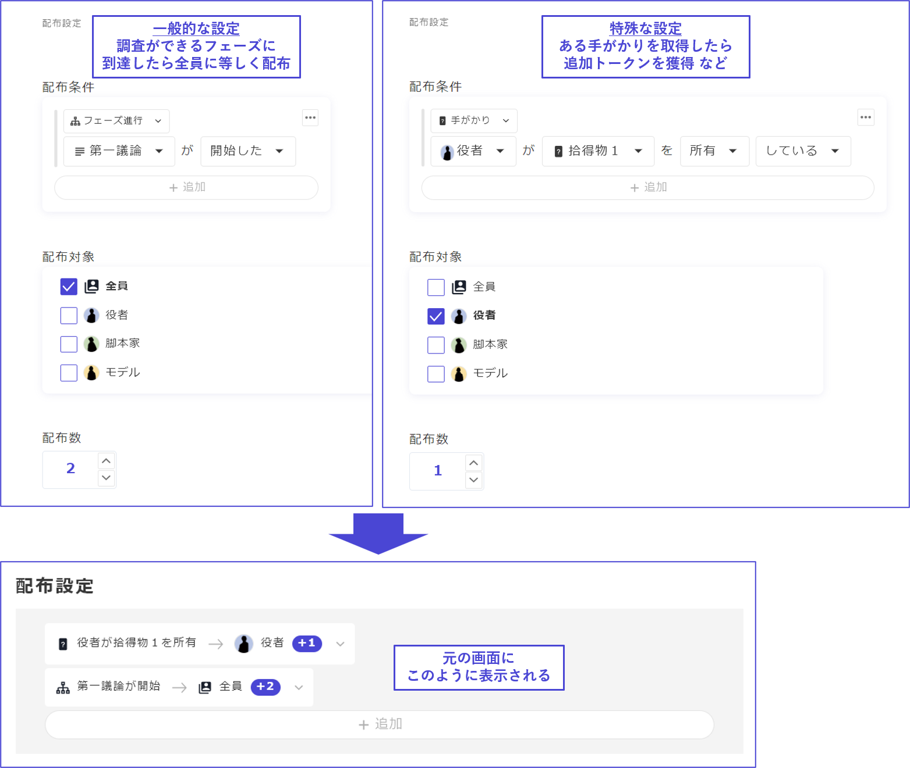
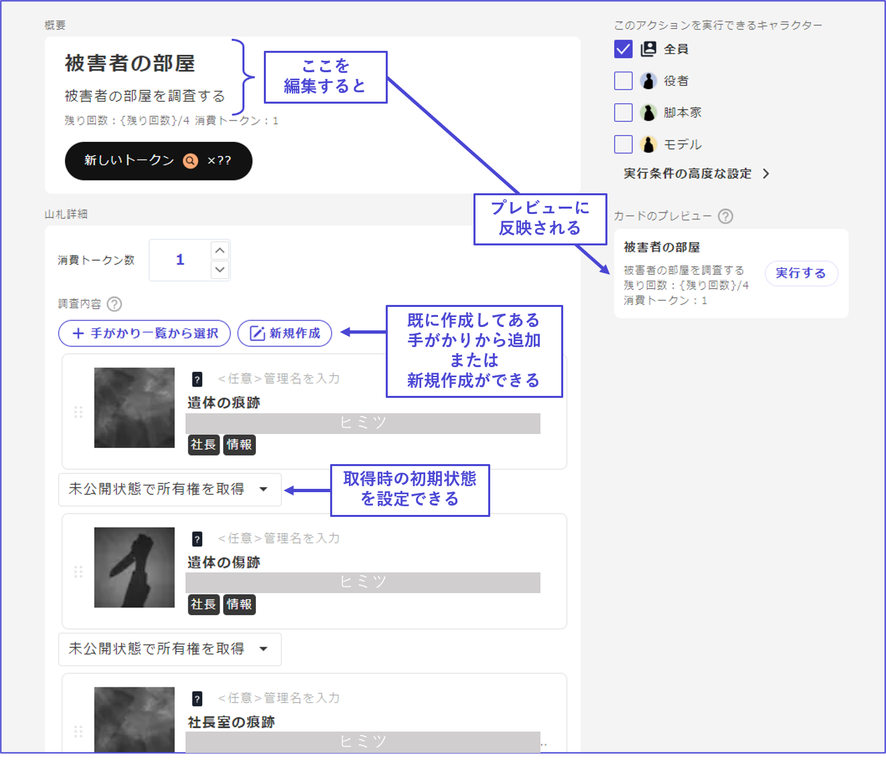
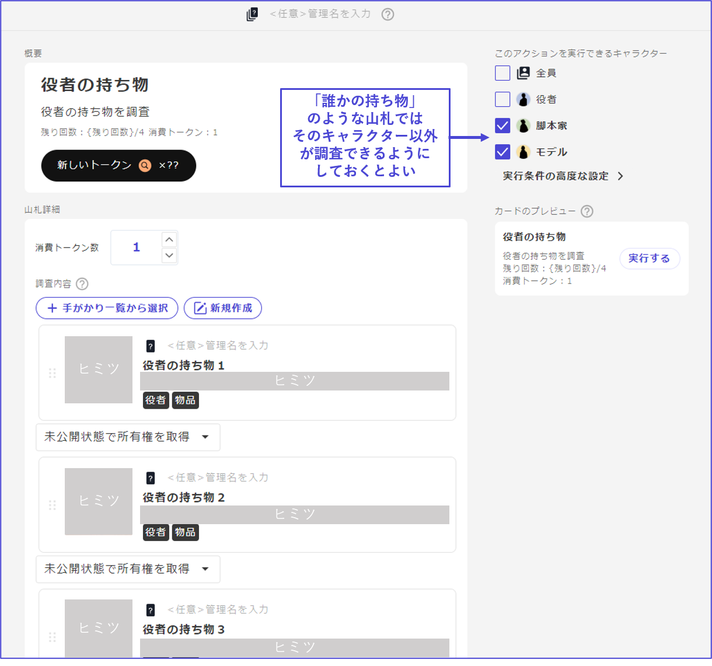
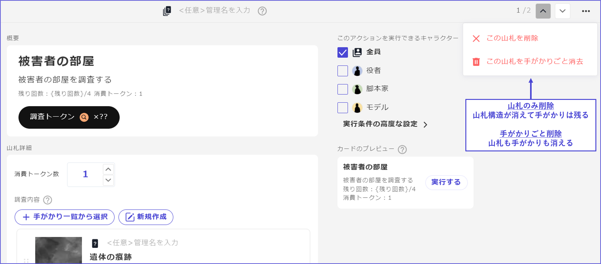
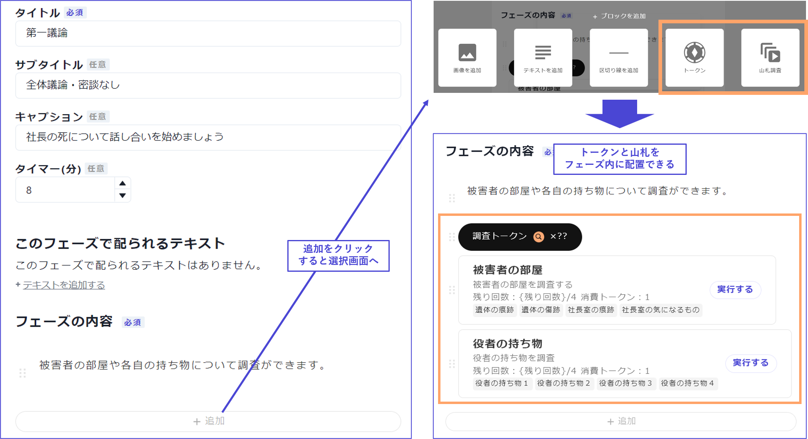
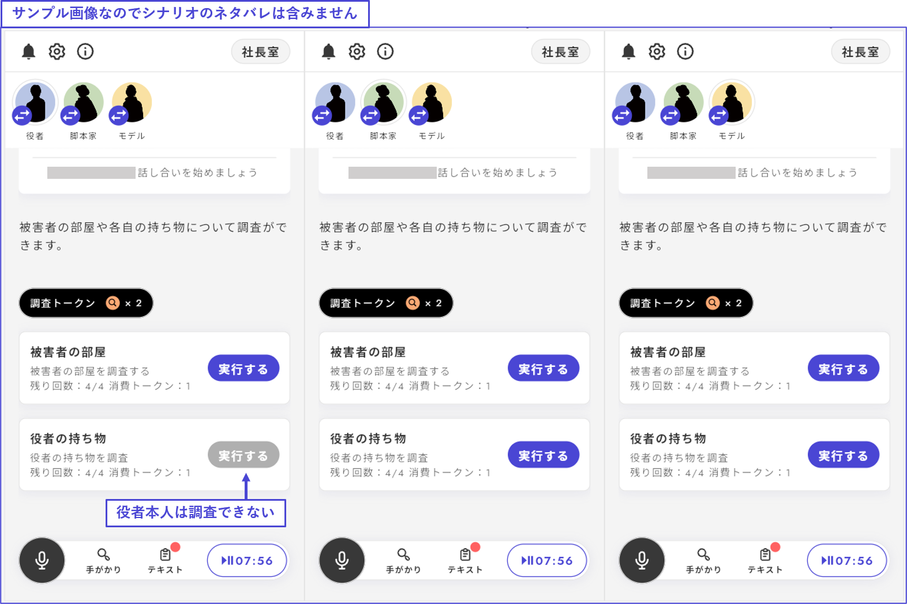

# 山札

山札では、任意のトークンを消費して手がかりを取得することができます。

## トークン・山札の作成

\\

トークンが未設定の場合は以下のような画面になるので、「トークン作成」をクリックしてください。

<figure><figcaption></figcaption></figure>

\\

トークン名、トークンの見た目、配布条件を設定します。 調査にお金がかかるイメージならコイン、時間がかかるイメージなら砂時計といったように決めるとよいでしょう。

用途に合わせて複数のトークンを設定することもできます。

<figure><figcaption></figcaption></figure>

\\

**全員に等しく配布**されるような通常の調査トークンであれば、あるフェーズに到達したときにきまった数だけ配布するとよいでしょう。

ある手がかりを取得したとき、ある選択肢に投票したときのように特殊な条件を満たした場合に配布されるトークンも設定できます。

\\

トークン設定が終わったら、左メニューから「山札」に戻ります。

「山札を追加」ボタンから、新しい山札を作成できます。

<figure><figcaption></figcaption></figure>

\\

## 山札の編集

山札の基本項目は以下の通りです。

* **タイトル**
  * 山札のタイトルです。
* **説明文**
  * 山札の説明文です。山札を使用するときのボタンが「**実行する**」という名前で固定されているので、実行するという文言に合うように説明文を書いてください。
  * 山札の残り枚数と消費トークンについては自動で表示されるので、説明文には含めないでください。
* **実行条件**
  * 山札の実行条件を設定できます。例えば、特定のキャラクターは実行できないようにする、特定の手がかりを持ってないと実行できないようにする、といった設定が可能です。
* **消費トークン**
  * 山札を引いたら何枚のトークンが消費されるかを設定できます。
  * 手がかりごとではなく、山札ごとに固定されます。
* **山札に含める手がかり**
  * 山札に含める手がかりを設定できます。何枚でも設定可能です。
  * **既に手がかりを作成している**場合は「手がかり一覧から選択」、**新しく手がかりを作成する**場合は「新規作成」をクリックしてください。
  * 手がかりそれぞれについて、山札から手がかりを引いた際に、手がかりを引いたキャラクターに所有権を持たせるのか、それとも全体公開になるのかなど、いくつかの設定が可能です。所有権を持っていると、その人の任意のタイミングで全体公開・共有・譲渡ができます。
  * 山札に含める手がかりでは、配布条件が自動的に「山札から引かれたとき」になるため、**手がかりごとの配布条件設定**が不要です。

\\

山札の削除には２種類の方法があります。

山札に含まれる**手がかりを残して山札構造のみ解除**する場合は「この山札を削除」、**山札もそこに含まれる手がかりも全て消す**場合は「この山札を手がかりごと消去」を選択してください。

\\

## 山札を設置する

山札は、「**基本**」フェーズに設置が可能です。基本フェーズはアイコンで見分けられます。

フェーズ一覧から、山札を設置したいフェーズを選択します。

\\

フェーズの内容の「追加」ボタンをクリックし、「**トークン**」と「**山札調査**」を選んでください。

調査中にそれぞれのキャタクターの残りトークンを閲覧できるようにするため、**山札調査を行うフェーズでは「トークン」の表示も一緒に設置**することを推奨しています。

\\

プレイ中の実際の画面は以下のようになります。

この例では、「役者の持ち物」を役者本人が調査できないようにしているため、一番左の役者の画面では「実行する」が押せないようになっています。

### 山札をランダムに配布する

デフォルトでは山札は設定している手がかりリストの上から順番に配布されますが、ランダムで配布することも可能です。

設定方法は、山札詳細画面の右側の「調査内容の取得順」の「ランダムに取得」にチェックを入れるだけで完了します。

<figure><figcaption></figcaption></figure>

※Webでの動作確認時には、「プレイ状況をリセット」を押しても順番はシャッフルされず、一度動作確認画面のタブを閉じてもう一度動作確認を立ち上げることによって再度シャッフルされます。
