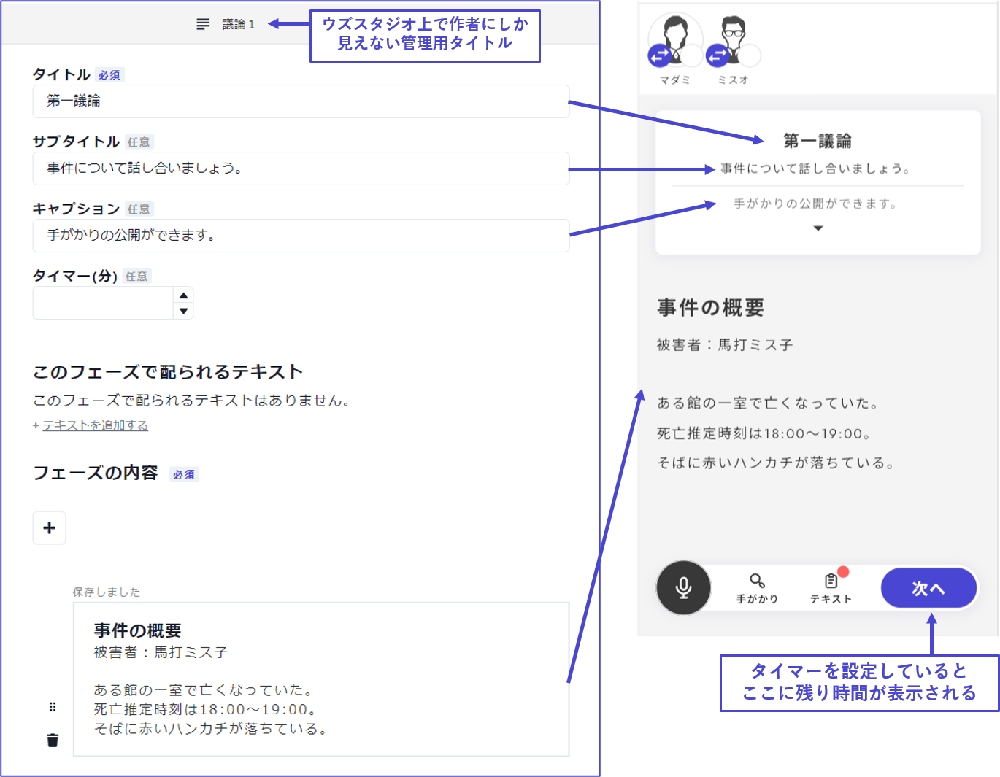
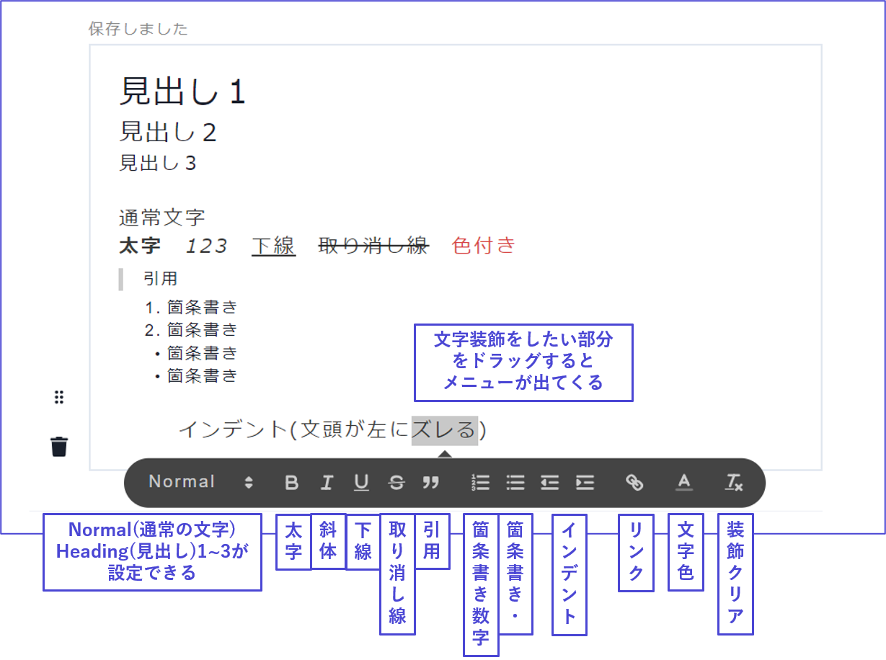
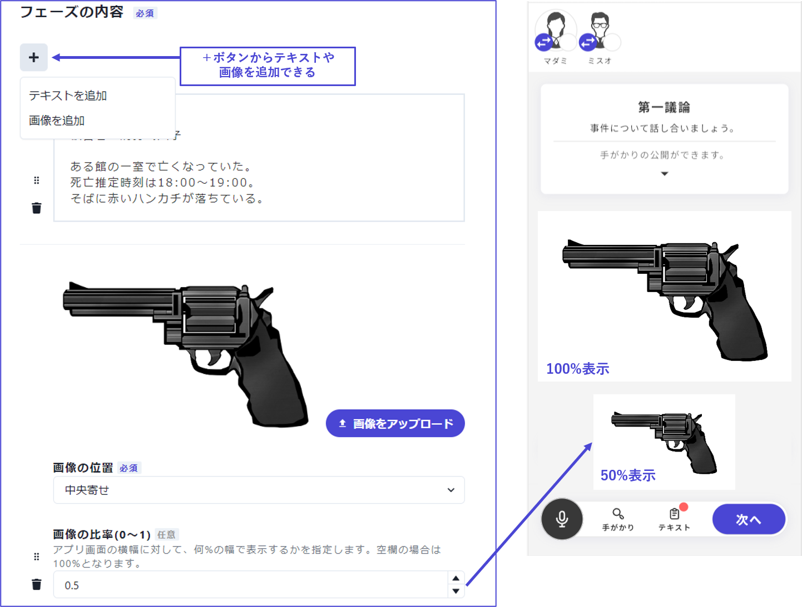
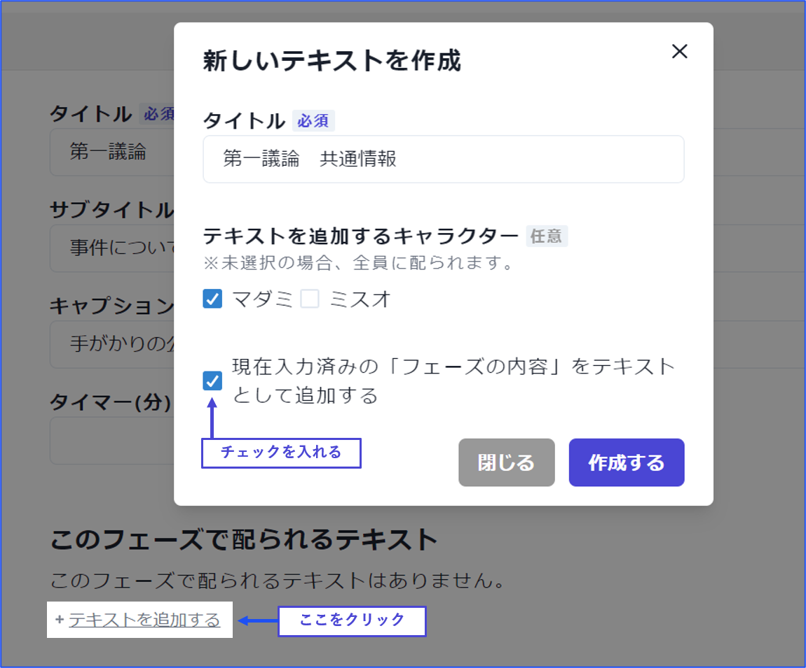

## 基本フェーズ

基本フェーズでは`テキスト`と`画像`の表示ができます。
キャラクターテキスト読み込み、議論、説明の提示、追加情報の確認などに適しているフェーズです。

| 項目       | 内容                               | 記入例               |
| -------------------- | ---------------------------------- | -------------------------------------- |
| タイトル(必須)       | トップに表示されるタイトルを設定します。       | キャラクターテキスト読み込み・第一議論など |
| サブタイトル(任意)   | タイトルの下に黒字で表示される文章を設定します。 空欄の場合は表示されません。         | テキストタブを開いてください・議論を始めてくださいなど     |
| キャプション(任意)   | タイトルの下にグレーで表示される文章を設定します。 空欄の場合は表示されません。     | 議論時間は10分です・手がかりの公開ができますなど  |
| タイマー(任意)       | フェーズの制限時間を設定します。 空欄の場合は好きなタイミングで「次へ」を押せるフェーズになります。     | 半角数字                 |
| フェーズの内容(必須) | 共通画面に表示するテキストや画像を設定します。 | 指示文・共通情報など         |

### フェーズの内容について
テキストや画像の追加は「＋」ボタンからおこないます。

テキストでは、以下のような文字装飾が使用できます。

 

画像では、画像を画面の`どこに揃えるか`（左寄せ・中央揃え・右寄せ）、どのくらいの`大きさ`で表示するかを設定できます。

 

このフェーズ中に共通画面に表示した情報を`テキストタブにも配布したい（後から見返せるようにしたい）`場合は「テキストを追加する」から「現在入力済みのフェーズの内容をテキストとして追加する」にチェックを入れ、「作成する」を押します。

