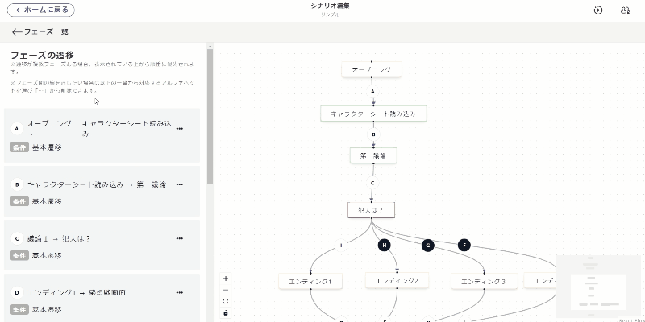

## フェーズ進行

フェーズ進行は**フェーズ同士の順番**や**分岐**を設定する画面です。

フェーズ一覧内の「フェーズ進行を設定」をクリックすると、編集画面に移動できます。

### 基本操作

基本的な操作は「並べる」「繋げる」の2つです。
フェーズとフェーズは以下のような操作をすれば繋げることができ、どのフェーズの次に何のフェーズが来るのかを設定することができます。
線上に書いてあるアルファベットと左列に表示されるアルファベットが対応しています。

### 遷移の種類

フェーズとフェーズの間の線（遷移）には、「**基本遷移**」と「**条件遷移**」の２種類があります。

| 遷移の種類                 | 見た目                           | 説明            |
| -------------------- | ----------------------------- | ------------------------------------- |
| 基本遷移     | ○白地に黒文字 | 「次へ」をタップ/設定した時間経過で遷移する 条件遷移のどれにも当てはまらないときに遷移する |
| 条件遷移   | ●黒地に白文字 | 条件を満たしている場合のみ遷移する |

 

ひとつのフェーズから複数の線（遷移）を設定すると、必ず１つが「**基本遷移**」、残りが「**条件遷移**」になります。
投票からエンディングへの**分岐**をイメージすると分かりやすいでしょう。

条件分岐が複数あるときは左列で**上から順に優先**となります。アルファベットはただの識別記号であり、優先順位とは関係ありません。

遷移の条件を設定したり、削除したりするときは「・・・」を押してください。

 

### よくある質問
- 分岐がある場合の遷移設定で、全てを条件遷移（黒地に白文字）にすることができないのなぜか？
    - 条件遷移で全ての可能性を網羅できていない場合、プレイヤーの選択によっては行きつくフェーズがない状態が発生し、進行不能になってしまいます。そういった状況に陥るのを防ぐため、必ず１つは「条件遷移で設定されてない残り全て」に対応する基本遷移（白地に黒文字）になるようにしてあります。  

- 同票のときとそうでないときで分岐を分けられるか？
    - 同票でも最多と見なす「同票最多」、単独トップのときのみ最多と見なす「単独最多」という条件が設定できます。例えば、４人シナリオで２対２となっていても２人が犯人に投票できていれば正答エンドに遷移させたい場合は「同票最多」を、２：１：１か３：１で犯人が最多である場合しか認めたくない場合は「単独最多」を使うと良いでしょう。