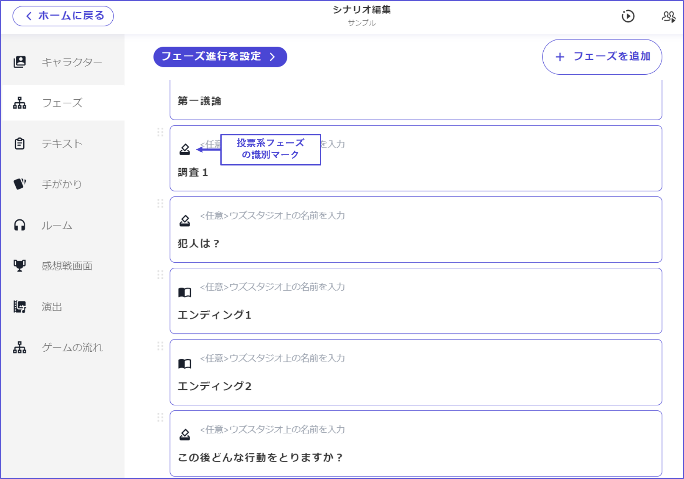

# 投票フェーズ

投票フェーズでは、犯人投票をはじめとした様々な投票を行うことができます。 ウズスタジオv2では、どこにでも何回でも投票フェーズを設置できるようになりました。

\

投票フェーズのための設定項目について説明します。

## 投票の選択肢（基本）

選択肢の名前や画像を設定します。画像がある場合とない場合の表示の違いは以下の通りです。

フェーズ完了条件について

次へボタン：投票先を選択しないと「次へ」を押せない状態になります。投票フェーズではこちらがおすすめです。

制限時間：投票先を選択していなくても設定したタイマーが0秒になったら次へ進んでしまいます。投票フェーズで制限時間を設定する場合は注意してください。

<figure><figcaption></figcaption></figure>

\

## 投票できるキャラクター

該当の投票フェーズで投票できるキャラクターを設定します。ここで特定のキャラクターを設定すると、そのキャラクターしか投票を行うことができません。代表者一人に投票を行わせたい場合などに有効です。

<figure><figcaption></figcaption></figure>

\

## 投票を閲覧できるキャラクター

該当の投票フェーズの投票内容を閲覧できるキャラクターを設定します。この設定をONにしたキャラクターの画面では、誰がどこに投票したのかがアイコンで示されます。重複投票を回避したい場合に有効です。

<figure><figcaption></figcaption></figure>

\

## 投票結果を感想戦画面に表示するか

投票結果とは、ある投票フェーズで誰がどの選択肢に投票して、各選択肢に何票集まったのかを示す画面です。ONにすると感想戦画面に投票結果が表示され、OFFにすると表示されません。

<figure><figcaption></figcaption></figure>

\

## 投票の選択肢（応用）

それぞれの選択肢に「表示条件」と「選択条件」を設定することができます。

「表示条件」は、ある特定の条件を満たしたときのみ、その選択肢が現れるようにする設定です。条件を満たしていないときは全キャラクターの画面で完全に非表示になるのが特徴です。 あるフェーズに辿り着いている時、ある手がかりを持っている時といった条件と相性が良いでしょう。

<figure><figcaption></figcaption></figure>

\

「投票条件」は、ある特定の条件を満たしたときやあるキャラクターのみ、その選択肢に投票できるようにする設定です。 投票できない選択肢は薄い色で表示されます。

<figure><figcaption></figcaption></figure>

\

同じ選択肢に2人以上が投票できないようにすることもできます。主に、投票と手がかりを組み合わせて調査フェーズを作りたい方向けの機能になります。調査フェーズの作成について、より詳しく知りたい方は、[こちらのページ](../../advanced/investigation.md)をご参照ください。

<figure><figcaption></figcaption></figure>
