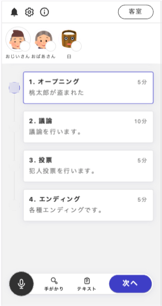

### シナリオの流れ

シナリオの流れ表示フェーズでは、シナリオの流れを表示することができます。ウズアプリ上では以下のような表示になります。

ウズスタジオでは、シナリオの流れはフェーズページでは編集できず、以下のような表示になります。

シナリオの流れは、[シナリオの流れタブ](/overview/timeline.md)で設定します。シナリオの流れタブで設定した情報が、すべてのゲームの流れフェーズで表示されます。なので、長い議論フェーズの区切りなどで用意すると親切でしょう。
