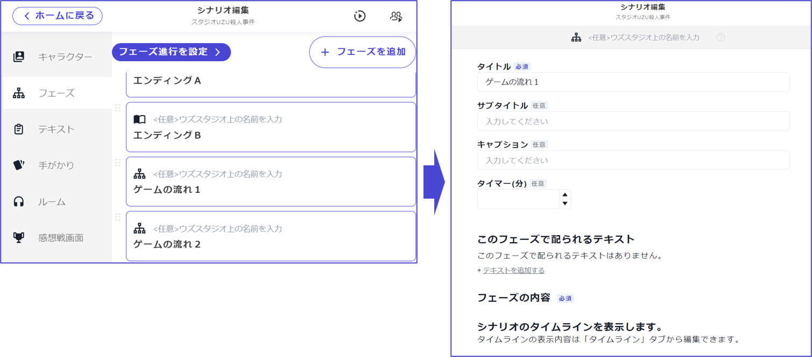
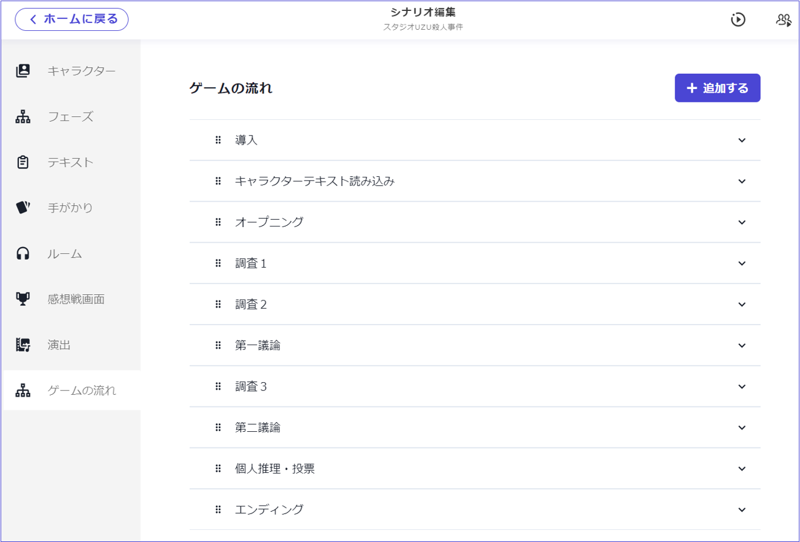

### ゲームの流れ

ゲームの流れフェーズとは、オープニングがあって、キャラクターテキスト読み込みがあり、議論をして、投票へ進み、エンディングといった**シナリオ全体の流れ**を示すフェーズです。プレイヤーが今どこのフェーズにいて、次はどのフェーズに進むのかを把握するものでもあります。

v1では、全てのフェーズとフェーズの間で自動的にゲームの流れが表示されていましたが、v2ではどこで表示するかを選べるようになりました。流れを止めたくないフェーズの間には入れずに進めることができます。

 

フェーズ一覧画面にある、ゲームの流れフェーズからは中身の編集はできず、以下のような表示になっています。

 

中身の編集は左のタブにある[ゲームの流れ](../../basic-features/timeline.md)の設定画面からおこないます。詳しくはそちらをご覧ください。

