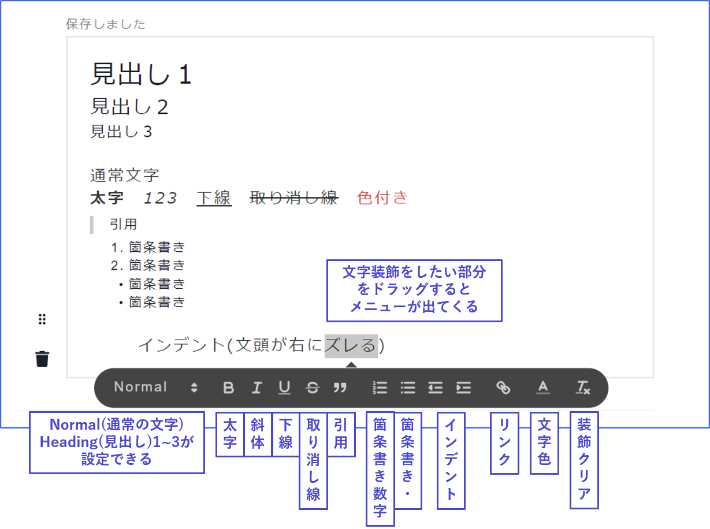

# テキスト

テキストでは、プレイ中にテキストタブに配布するテキストを設定・編集できます。

<figure><figcaption></figcaption></figure>

## 新規テキストの追加

テキスト一覧画面の右上「**テキストを追加**」をクリックすると、「新しいテキストタブ」が作成されます。

「新しいテキストタブ」をクリックすると、内容の編集画面に移動します。

<figure><figcaption></figcaption></figure>

また、フェーズ画面右下の「フェーズ内容の記録」でテキストグループ名を選択すると、フェーズの内容と完全に同期したテキストが、該当のフェーズ終わりに配布されます。

オープニングの文章を後から読み返せるようにフェーズ終わりにも配布したい、フェーズで表示した共通情報をテキストにも残したいといった場合にご利用ください。

<figure><figcaption></figcaption></figure>

## テキストグループ

テキストを種類ごとに分かりやすくまとめる機能です。

画像左のようにウズスタジオで設定すると、アプリ上では画像右のように表示されます。グループ分けの例は以下の通りです。

* 「共通」「個別」「読み合わせ」のように分ける
* 「メイン」「概要（説明）」「読み合わせ」のように分ける

<figure><figcaption></figcaption></figure>

## テキストタブの内容

テキストタブには、テキストや画像はもちろんのこと、区切り線や吹き出しも入れられます。

それぞれ追加ボタンから追加してください。後から順番を入れ替えることもできます。

<figure><figcaption></figcaption></figure>

テキストでは、以下のような文字装飾が使用できます。

画像では、画像を画面の**どこに揃えるか**（左寄せ・中央揃え・右寄せ）、どのくらいの**大きさ**で表示するかを設定できます。

<figure><figcaption></figcaption></figure>

「特定のフェーズに辿り着いている時」に「特定のキャラクター」に配布するといった基本的な条件以外にも、**複雑な配布条件**を設定することができます。**特殊な情報**や**追加情報**の配布の際に活用してください。

キャラクターや条件によってテキストや画像の表示・非表示を制御する事も出来ます。詳しくは [text-customize.md](../advanced/text-customize.md "mention") をご覧ください。

## アプリ上での表示順

ウズスタジオのテキスト一覧における**上から**の順番＝アプリ上のテキストタブ内における**左から**の順番となります。

アプリ上で表示したい順番に入れ替えておきましょう。

<figure><figcaption></figcaption></figure>
