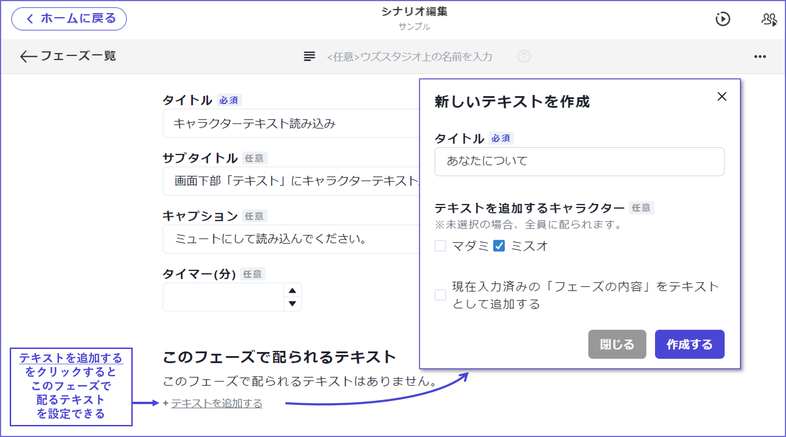

## テキスト

テキストでは、プレイ中にテキストタブに配布するテキストを設定・編集できます。

 

### 新規テキストの追加

新規テキストの追加方法は2種類あります。

 

#### ①テキスト一覧から追加

テキスト一覧画面の右上「**テキストを追加**」をクリックすると、「新しいテキストタブ」が作成されます。

「新しいテキストタブ」をクリックすると、内容の編集画面に移動します。

 

#### ②配布したいフェーズ内から追加

フェーズの編集画面内にある「**テキストを追加する**」をクリックすると、ポップアップがでてきます。

配布するテキストのタイトルや配布対象を設定して「作成する」をクリックしてください。

 

特定のフェーズで配る設定をしているテキストの一覧は、フェーズの編集画面内からも分かるようになっています。

「このフェーズで配られるテキスト」の下に表示されているテキスト名をクリックすると、そのテキストの編集画面に直接飛ぶことができます。

 

### テキストタブの内容

テキストタブには、テキストや画像はもちろんのこと、区切り線や吹き出しも入れられます。

それぞれ「＋」ボタンから追加してください。後から順番を入れ替えることもできます。

 

テキストでは、以下のような文字装飾が使用できます。

 

画像では、画像を画面の**どこに揃えるか**（左寄せ・中央揃え・右寄せ）、どのくらいの**大きさ**で表示するかを設定できます。

 

「特定のフェーズに辿り着いている時」に「特定のキャラクター」に配布するといった基本的な条件以外にも、**複雑な配布条件**を設定することができます。**特殊な情報**や**追加情報**の配布の際に活用してください。

※リデザインにより、条件設定部分の見た目が画像とは少し変わっています。

 

### アプリ上での表示順

ウズスタジオのテキスト一覧における**上から**の順番＝アプリ上のテキストタブ内における**左から**の順番となります。

アプリ上で表示したい順番に入れ替えておきましょう。

