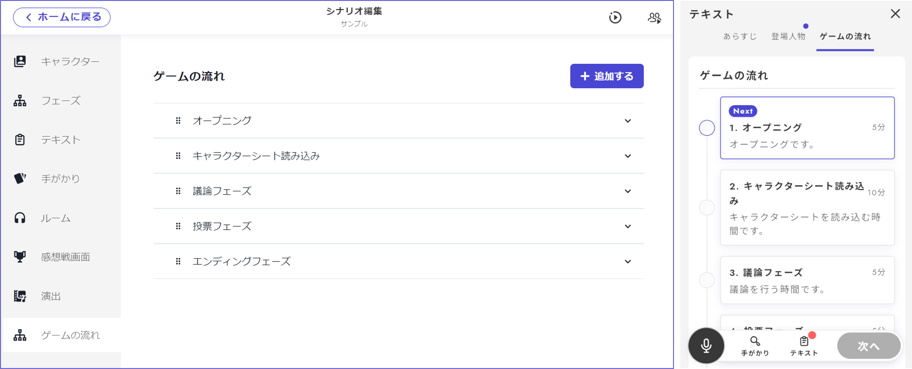
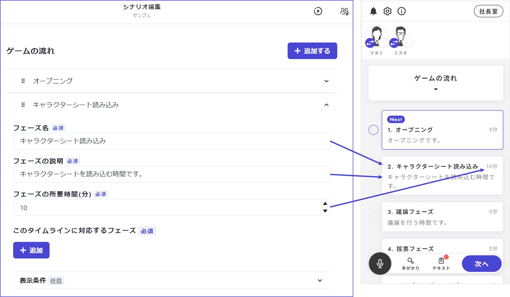
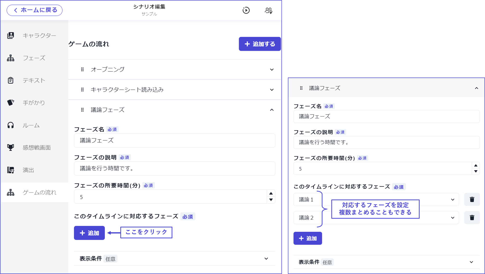
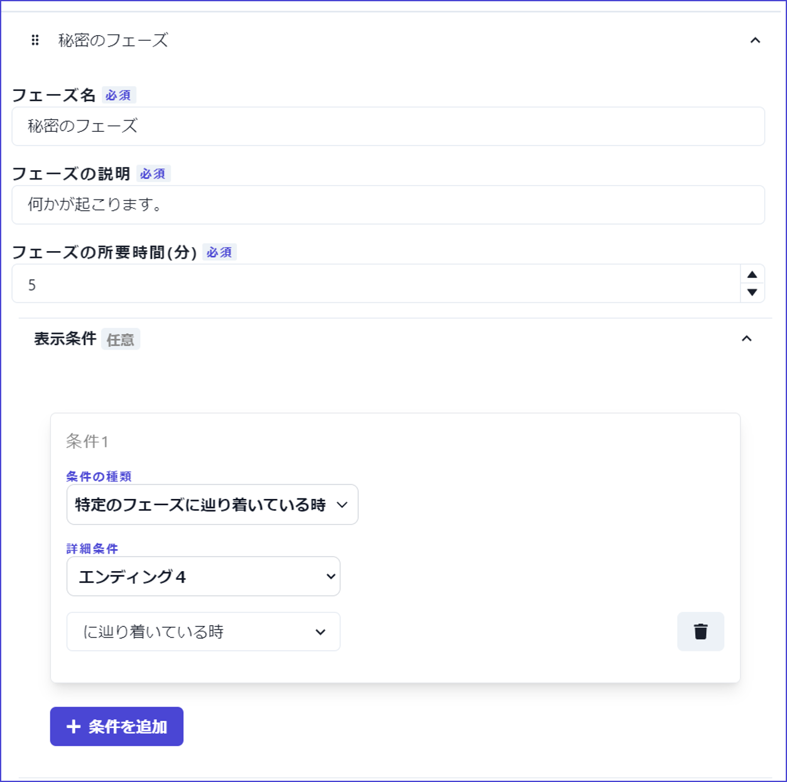
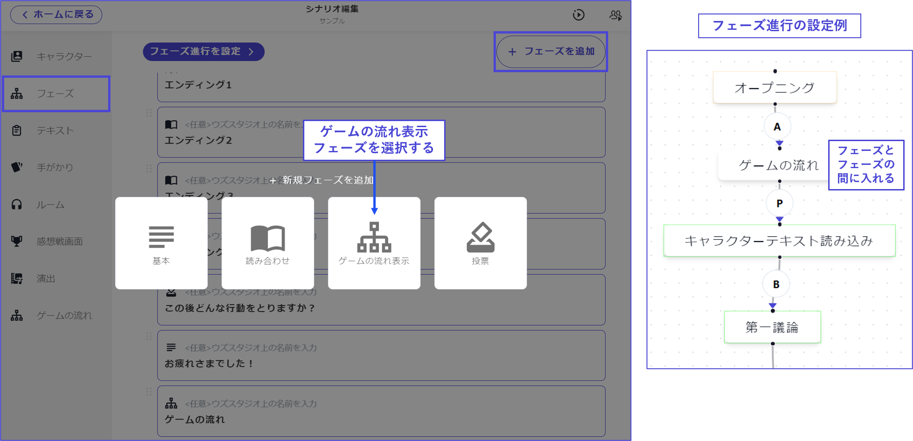

# ゲームの流れ

v1ではゲームの流れが自動生成されて表示されていましたが、v2では自由に作成できるようになりました。

フェーズの作成やフェーズの進行設定が概ね終了したら、それらに合わせてゲームの流れを設定しましょう。

\

## 基本項目（必須）

基本項目は「フェーズ名」「フェーズの説明」「フェーズの所要時間」です。

それぞれ以下のように表示されます。

\

## 対応するフェーズ（必須）

作成したゲームの流れそれぞれに対応するフェーズをフェーズ一覧から選びます。

１つの表示に**複数のフェーズ**をまとめて設定することもできます。

\

## 表示条件（任意）

特定の項目をいつまで**非表示**にしておき、いつから表示するかを設定することができます。

あるエンディングを通過したときにしか現れない秘密のフェーズがある場合、ゲーム序盤では明かされていない追加議論がある場合などに有効です。

オープニング、キャラクターテキスト読み込み、通常議論など、非表示にしておく必要のないフェーズでは設定しなくてよいでしょう。

\

## ゲームの流れを表示する

v2では、特に設定していなければ、フェーズとフェーズの間に、今どこまで進んでいて次のフェーズが何であるかを示すような画面は表示されません。

**フェーズとフェーズの間にゲームの流れを表示したい**場合は「ゲームの流れ表示」フェーズを作成する必要があります。

\

①フェーズ一覧から「フェーズを追加」をクリックします。

②「ゲームの流れ表示」フェーズを選択します。

③「フェーズ進行を設定」に移動します。

④入れたいフェーズの間に、②で作成した「ゲームの流れ」を挟みます。

