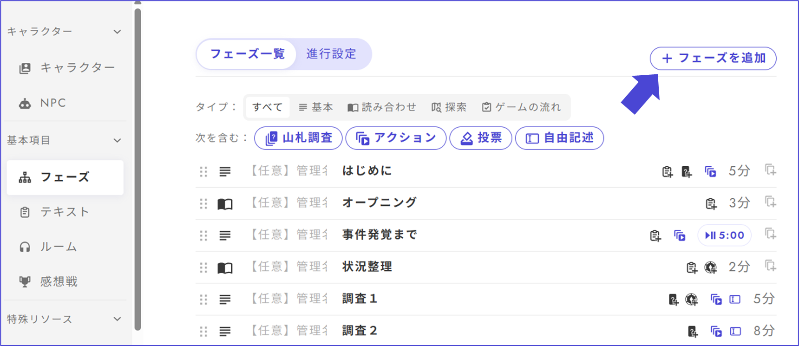

# トークン

トークンは、調査トークンとしての用途のほかに、状態のON/OFFの判定、数値比較など様々な活用が可能です。

## 調査トークン 

手がかりを得る際に消費するトークンとする、最も一般的な使い方です。

### トークンの作成 

1. トークン編集画面で「トークンを作成」を押します（2つ目以降は右上の「トークンを追加」から）
2. 調査トークンなど名前を入力し、アイコンの形と色を選びます
3. 「配布条件を追加」を押します
4. トークンを配りたいフェーズ、配る数を設定します

<figure><figcaption></figcaption></figure>

### 山札でのトークン消費設定 

1. 山札の編集画面で「消費トークン追加」を押します
2. 消費トークン欄に先程作成したトークンを設定し、消費数を決めます
3. 「消費数と所持数を表示」は、アプリで山札調査を実行する画面での表示のON／OFFを指します（基本ONでよい）

<figure><figcaption></figcaption></figure>

調査トークンと合わせて別のトークンも消費する設定にすることで、スキルが必要な山札や特殊調査にも対応できます。

<figure><figcaption></figcaption></figure>

