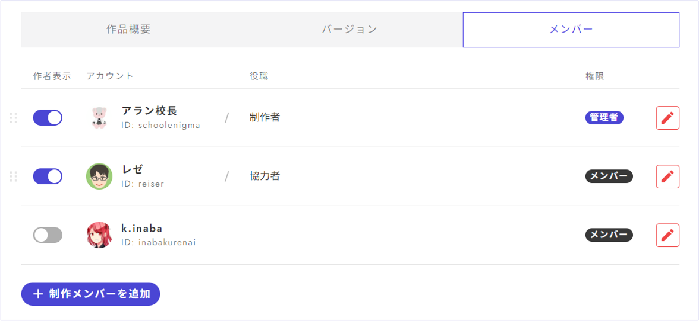
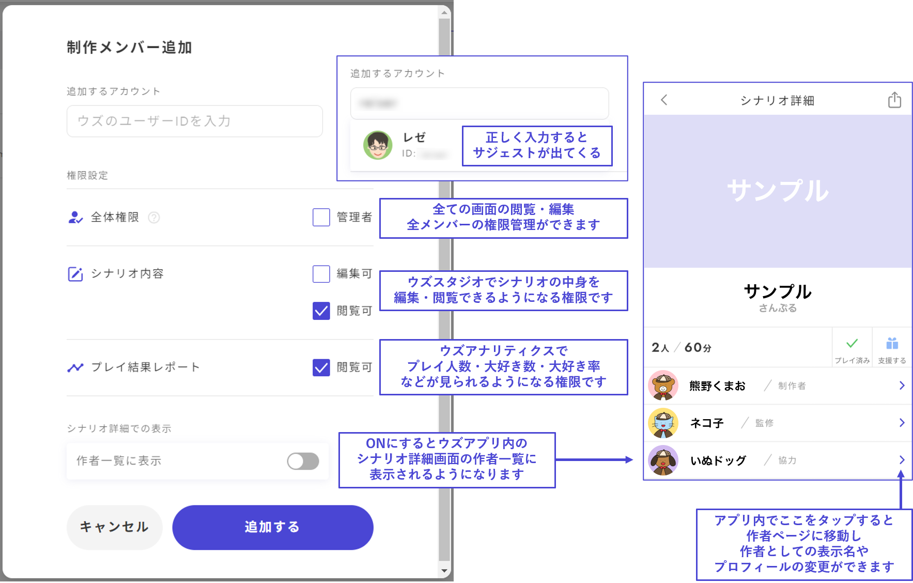

# メンバー管理

メンバー管理画面では、共同制作者・閲覧者の追加やアプリ内の作者一覧に表示するメンバーの整理ができます。

 

## メンバー追加

①「制作メンバーを追加」というボタンを押します。

②追加したいメンバーのウズのユーザーIDを入力します。正しく入力できているとアイコンが出てくるので、それをクリックします。

③権限設定をします。

④ウズアプリ内のシナリオ詳細にて作者一覧に表示するかどうかを選択します。作者一覧に表示する場合、作者プロフィールはウズアプリ内より編集できます。「プレイヤーとしてのニックネーム」と「作者としての表示名」を別のものにすることもできます。

 

## メンバー整理

「役職」はウズアプリ内のシナリオ詳細にて作者名の横に表示されるものです。

表示される作者の順番を変えることもできます。

