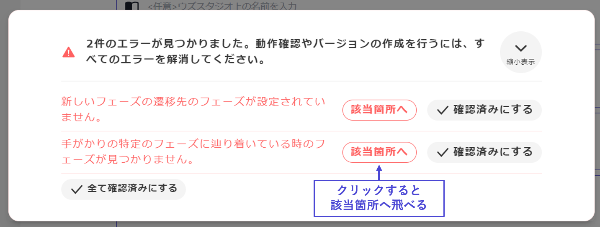
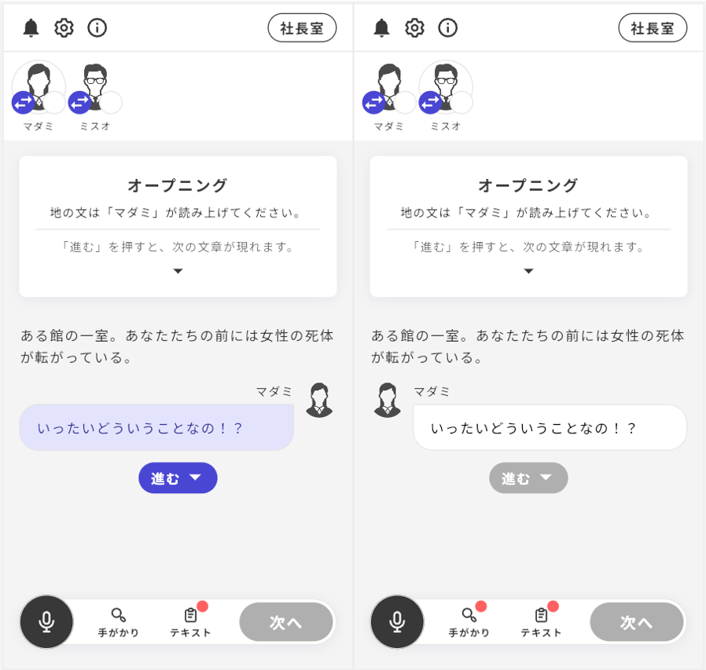

## 動作確認

実際のアプリでテストプレイをする前に、ウズスタジオ上で動作確認を実施することができます。

エディター画面の右上の「再生ボタン」をクリックすると、動作確認用の画面に移動します。

 

「動作確認出来るか確認」をクリックすると、設定漏れがないかのチェックが自動で行われます。

設定漏れがある場合は、**未設定箇所が赤文字で表示**されるので、適宜修正してください。

全て設定できている場合は「**動作確認を行う**」が表示されるので、クリックしてください。

 

アプリとほぼ同じ画面を操作しながら動作確認を行います。

BGMやSEも流れます。

