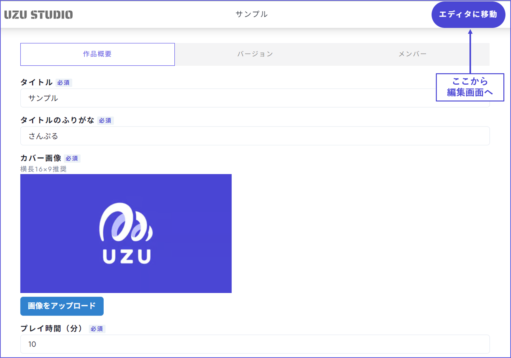

# シナリオ制作画面

### ホーム画面

ホーム画面にある項目と設定できる内容は以下の通りです。

| 項目                 | 内容                           | ウズアプリで表示される場所             |
| -------------------- | ----------------------------- | ------------------------------------- |
| 作品概要     | プレイ時間・シナリオ傾向・注意事項・あらすじ・作者コメント・ハッシュタグ・配信条件を設定する画面です。 | シナリオ詳細画面 |
| バージョン  | 作品の制作ステータス・バージョンなどが見られる画面です。 テストプレイ時のイベント作成に必要なシナリオIDをコピーできる場所でもあります。 | －     |
| メンバー　　   | 共同制作者や閲覧権限を管理できる画面です。  | シナリオ詳細画面のタイトルの下       |

 

#### 関連事項

- 作品概要のそれぞれの欄に何を書けばいいのかについては、編集部が作成している[こちらの記事](https://uzu-app.notion.site/e56aef54e029430dbe3131b2b96b1575?pvs=4)をご参照ください。

- テストプレイの方法については、編集部が作成している[こちらの記事](https://uzu-app.notion.site/d004b22fe584451bb026aee76dbd08f2?pvs=4)をご参照ください。

 

### エディタ画面

右上の「エディタに移動」をクリックすると、シナリオの制作・編集画面へ移動できます。

