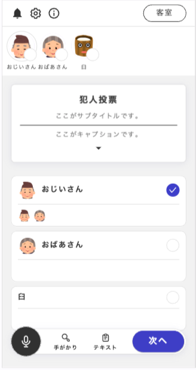

## 投票

投票フェーズでは、犯人投票をはじめとした様々な投票を行うことができます。ウズアプリでの表示は以下の通りです。

ウズスタジオでは以下のような設定を行います。

ウズスタジオのそれぞれの項目について説明します。

### 投票できるキャラクター

該当の投票フェーズで投票できるキャラクターを設定します。ここで特定のキャラクターを設定すると、そのキャラクターしか投票を行うことができません。代表者一人に投票を行わせたい場合などに有効です。

### 投票を閲覧できるキャラクター

該当の投票フェーズの投票内容を閲覧できるキャラクターを設定します。この設定をされたキャラクターは、ウズアプリ上で投票フェーズが以下のような表示になります。上の画像との違いは、投票の選択肢の下にどのキャラクターが投票したのかを表示できるようになる点です。

### 投票の選択肢

選択肢は、画像ありパターンとなしパターンの二つがあります。画像ありパターンは上の例の「おじいさん」・「おばあさん」です。キャラクター画像以外にも任意の画像を設定することができます。
