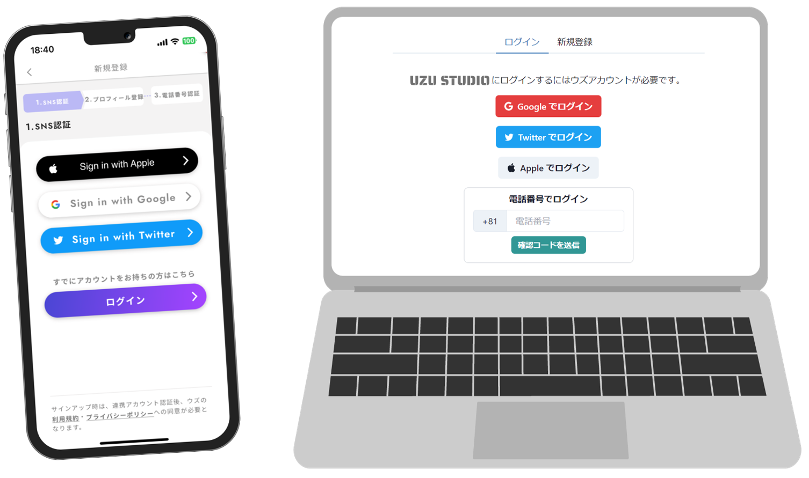

# ログイン方法

アプリ「ウズ」でアカウントを作成してから、同じアカウントでウズスタジオにログインします。

「ウズ」で電話番号を登録している方が多いと思いますので、「**電話番号でログイン**」がおすすめです。

ウズスタジオへのアクセスURLは「ウズスタジオ公式サーバー（Discord）」の「参加したらここを見る」チャンネルで案内されています。ブックマークをしていなかった、見失ってしまったという方は、そちらからご確認ください。

ウズのアカウントに外部サービスを連携している場合は、それらの方法でログインすることもできます。

<figure><figcaption></figcaption></figure>

