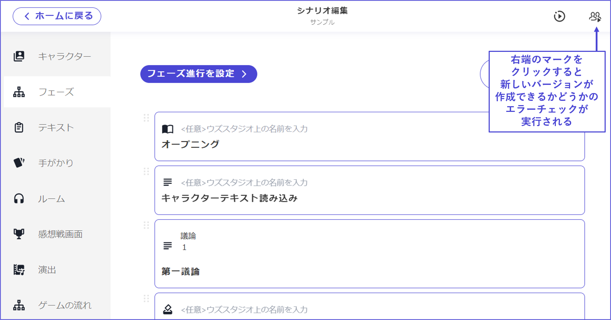
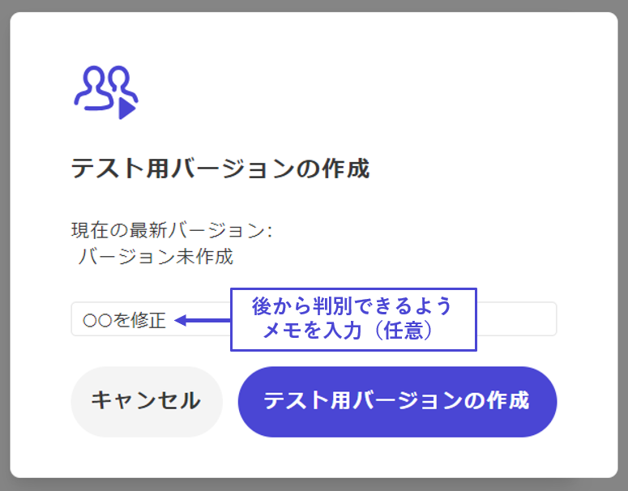
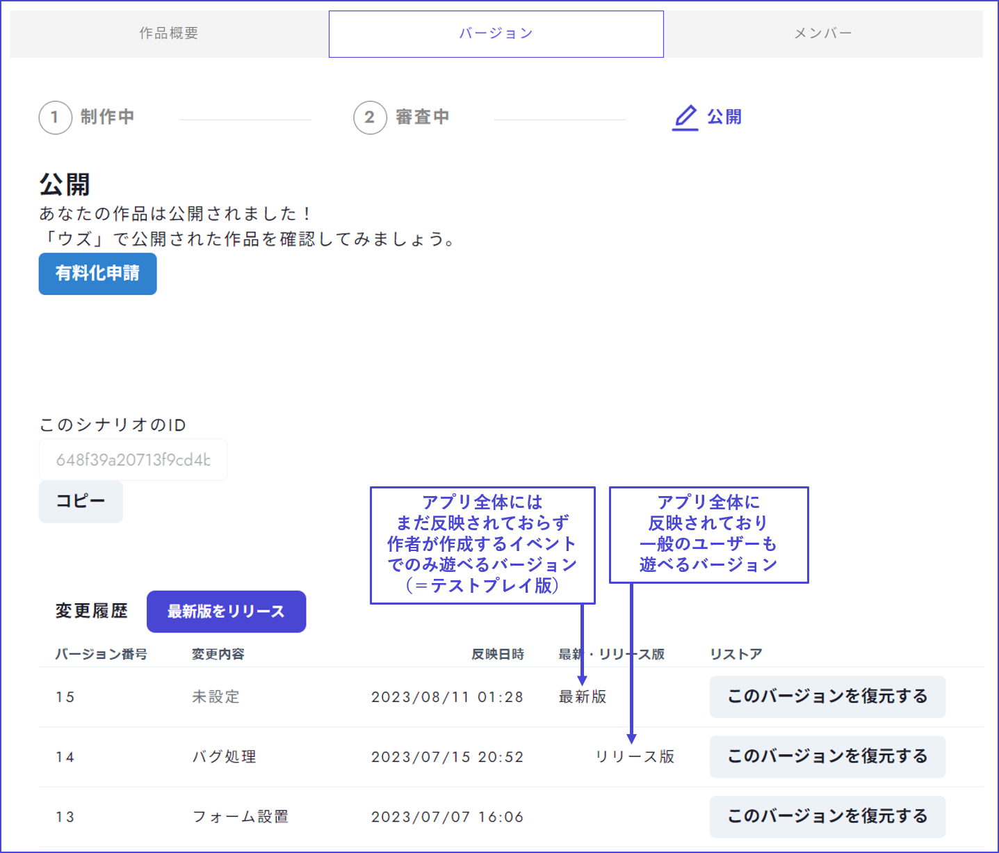

# 作品提出

## アプリに反映

シナリオの制作が終わったら、まずは制作した内容をアプリに反映してテストプレイを実施しましょう。そのために、バージョンを作成する手順を踏む必要があります。

右上のボタンを押すと、新しいバージョンが作成できるかどうかのエラーチェックが自動でおこなわれます。

 

設定漏れがある場合は、**未設定箇所が表示**されるので、適宜修正してください。

「**該当箇所へ**」をクリックすると、エラーが出ている場所へ直接飛ぶことができます。

 

全て問題なく設定できていれば、バージョン作成のためのポップアップが出てきます。

入力欄は、何を修正したのかを後から確認しやすくするための自分用のメモ欄です。作者以外には見えないものなので、自由に記入してかまいません。また、空欄でも問題ありません。

 

※最新バージョンとは？

作者だけがイベント作成できるテストプレイ用であり、アプリ上の一般ユーザーはプレイできないバージョンのことです。

v2では、v1に比べて自由度が高くなった分、設定箇所や考慮する部分が多くなっており、実装ミスが発生しやすいと考えられます。ミスが残ったままのバージョンが公開されてしまわないよう、一度、最新バージョンが作成されるようになっています。最新バージョンは、バージョン管理画面で「最新版」と表示されます。

バージョン管理画面から「**最新版をリリース**」を押すと、一般ユーザーも遊べるバージョンとしてアプリ上にリリースされます。v1→v2移行作品では**移行申請が承認されるまで**、v2新作では**審査通過するまで**「最新版をリリース」は押せないようになっています。

 

## 審査提出

テストプレイと修正が終わったら、作品を審査に提出しましょう。

ホームから「**バージョン**」画面に移動します。
確認事項を読み、チェックを入れて、「**本公開申請**」ボタンを押します。

審査は、**無料**公開予定の作品に対する**簡易審査**と**有料**公開予定の作品に対する**詳細審査**に分かれています。
本公開申請ボタンを押した先の**フォーム**から、どちらの審査に提出するか選択し、必要事項を記入してください。

 

## 最新版とリリース版

v2では「最新版」と「リリース版」という概念があります。
作品が審査を通過するまでは「最新版」のみとなっており、審査通過後に「リリース版」へ変更することができます。

アプリ上で作品を公開した後、ウズスタジオから誤植等の内容の修正を行った場合は「アプリに反映する」と「最新版をリリース」の2つを押し忘れないよう注意してください。

| 名称                 | 内容                          | バージョン            |
| -------------------- | ----------------------------- | ------------------------------------- |
| 最新版 | 「アプリに反映する」を押した最新内容。  | 作者が作成するイベントでのみ遊べる最新バージョンであり、テストプレイ版とも言える。 |
| リリース版 | 「アプリに反映する」→「最新版をリリース」を押した内容。  | アプリ上で一般ユーザーも遊べるバージョン。       |

