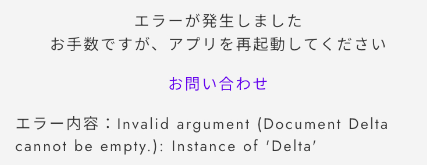
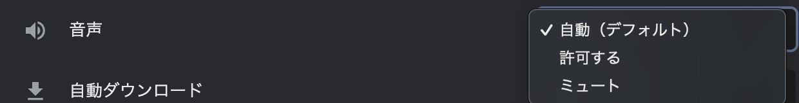

# Frequently Asked Questions

## About Characters

How many PCs and NPCs can be created?

You can create up to 7 PCs (Player Characters).\
There is no limit for NPCs (Non-Player Characters) in theory.

Where can I check the mission set during gameplay?

The mission set in the character editing screen of Uz Studio will **only be displayed in the post-game discussion screen**. It will not automatically appear in the text tab during gameplay, so if you want to present the mission to players, make sure to **include it as text in the distributed materials**.

\\

## About Phases 

Why can't I set all transitions to conditional transitions (blue lines) when there are branches?

If all possibilities are not covered by conditional transitions, there may be situations where players encounter a phase with no destination, causing the game to become **unplayable**. To prevent this, there must always be one **default transition** (black line) to cover all other conditions not set by conditional transitions.

Can branches be separated depending on whether there is a tie in votes?

You can set conditions for "Tied Majority," where tied votes are considered the majority, or "Solo Majority," where only a single top vote counts as the majority.

For example, in a 4-person scenario, if you want to branch to the correct ending even if the vote is 2:2, you should use "Tied Majority." If you only want to recognize the correct ending when the vote is 2:1:1 or 3:1, use "Solo Majority."

Can images be inserted into the reading phase?

Yes, you can insert images by clicking the icon with six dots next to the dialogue box and selecting "Convert to Image."

\\

## About Text

Can I distribute text that cannot be re-read after a certain phase?

Set the distribution conditions for the text to "Only while in a specific phase."

Text disappears after moving to another screen. Why?

It may be due to a delay in reflection. Try refreshing the page with "Ctrl + R" or "Command + R."

Non-numeric text is not italicized. Why?

Italic formatting does not appear in the editor screen but will be reflected during testing or in the app.

Text color change is not reflected. Why?

If you overwrite text that was originally not black, the color change may not immediately appear in the editor. Please refresh the page with "Ctrl + R" or "Command + R" to reflect the changes.

I can't upload an image. Why?

Images larger than 4.5MB cannot be uploaded. Please compress the image before uploading.\
If the image is under 4.5MB but still doesn't upload, try refreshing the page with "Ctrl + R" or "Command + R."\
If the problem persists, please contact the support team.

I get an "Error has occurred" message during testing. Why?

This is likely caused by an empty text box. Delete the empty text box from the editor screen in Uz Studio to resolve the issue in the next test play.

\\

## About Clues

Can I show different clue information depending on who is viewing it?

Yes, this is possible. Please refer to [this page](advanced/text-customize.md).

Can I hide a distributed clue at a specific timing?

Use the [Clue Collection](basic-features/clue.md#hui-shou-tiao-jian-ren-yi) feature.

\\

## About Rooms

No questions have been asked yet.

\\

## About the Post-Game Discussion Screen

I don't know what to write in the post-game discussion screen. Any tips?

If your scenario requires reasoning, be sure to add a tab for the solution and its explanation. If you are unsure what content to include as an explanation, please refer to the article "How to Write a Solution Text" in the "Editing Department" channel on the official Discord server.

Links placed in the post-game discussion screen are not responsive. Why?

Link behavior varies depending on the device and environment, such as whether the link transitions correctly or crashes the app. Because of this, new links cannot be placed. However, displaying the URL as text or placing a QR code image is possible.

For previously placed links,\
they will not respond when clicked during testing.

\\

## About Effects 

Can I change the BGM during a phase?

Yes, it is possible during the reading phase. Please refer to the [Effects](basic-features/bgm.md) section for the method.

There's a BGM that I can't upload. Why?

You cannot upload BGM that exceeds 2MB per minute. You can search for "mp3 compression" to find websites that allow you to reduce the file size to less than 2MB per minute before uploading.

The BGM volume is too loud. How can I adjust it?

You can either adjust the volume using applications like Audacity or through websites that allow volume control before uploading, or you can use the volume adjustment button within Uz Studio.

To check the actual volume in the app, access Uz Studio via your smartphone, put on headphones, and play the BGM.

\\

## About Game Flow

The time limit displayed in the game flow differs from the one set in the phase. Why?

In addition to setting the timer in the phase editing screen, you also need to enter the time limit in the [Game Flow](QandA.md#gmunorenitsuite) editing screen. To resolve the discrepancy, make sure to input the same time in both the phase editing screen and the game flow editing screen.

\\

## Other

"This account is not linked to Uz" message appeared. What should I do?

Click "Logout" on the screen and log in again. If the issue persists after re-logging in, please contact the support team.

The content of the scenario seems to have disappeared. What should I do?

It is likely just a loading issue. Please refresh the page with "Ctrl + R" or "Command + R" or wait and check again later. If the issue persists, please contact the support team.

"Application error" message appeared. What should I do?

This error may occur if multiple operations were performed consecutively, causing the page to not load properly. Please refresh the page with "Ctrl + R" or "Command + R" or wait and try again. If the issue persists, please contact the support team.

"Undefined phase" error appeared during testing. What should I do?

This requires support intervention. Please contact the support team.

Sound set to play from the first phase is not playing during testing. Why?

In Google Chrome, sound set to play from the first phase does not automatically play. It works fine in the app, though. You can try one of the following:

1. Test in another browser (such as Safari).\
2. Change Google Chrome's autoPlay policy settings.\\

Here’s how to change the autoPlay policy settings:\

1. Click the lock icon in the URL bar on the test screen → Click "Site Settings"\
   \\
2. Under the "Sound" section, click "Automatic (default)" → Change it to "Allow"\
   \\

How do I add a co-editor?

You can add a co-editor from the "Members" section of the scenario home screen. Click "Add" and enter the co-editor's **Uz user ID**.

The "Author Page" is not displayed in the side menu of the Uz app. Why?

The "Author Page" will appear once you've created at least one scenario after logging into Uz Studio.

For more details, please refer to [this section](top/profile.md#pjibotan).

"This site can't be reached" or "ERR_CONNECTION_CLOSED" message appeared. What should I do?

This is often due to temporary security restrictions by your Wi-Fi. There are reports that it resolves after about one day.

If you're in a hurry, you can access it via tethering or using 4G/5G on your smartphone.

