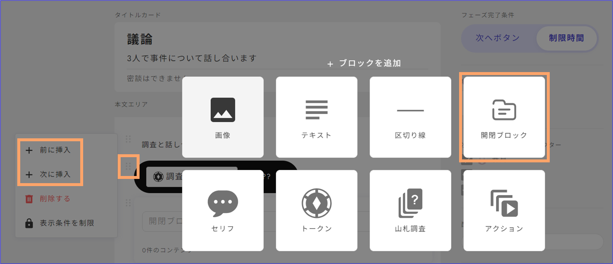

# Adding Expandable Blocks

**Expandable blocks** are collapsible sections that can be opened and closed with a tap. They are useful when you want to **group multiple texts or card decks** together.

## Adding an Expandable Block

Click the "Add Phase" or "Add Text" button, or click the "⋮" symbol and select "Insert Before/After." Then, choose the expandable block option.

<figure><figcaption></figcaption></figure>

## Adding Content to an Expandable Block

Click the arrow on the right side of the added expandable block to make it point downwards and open the block.

Click the "Add" button to insert your desired widgets. You can add **text, images, dividers, dialogue, card decks, or additional nested expandable blocks**.

To move items in and out of the expandable block, drag them as needed. For larger text boxes or content that doesn't move easily, you may need to use copy and paste.

The image below shows an example where a card deck has been added. This is useful for grouping multiple investigation areas or categorizing content. During actual gameplay, tapping the arrow will open the block as shown on the right.

<figure><figcaption></figcaption></figure>

## Layered Structure

You can add **more than two layers** of expandable blocks.

This is useful when dealing with long character texts that show actions by time and you want to separate them into blocks by time.

You can also apply [display conditions](text-customize.md) for each layer or text.

<figure><figcaption></figcaption></figure>
