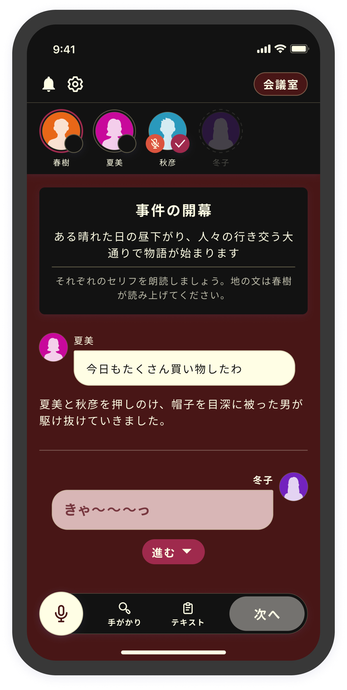

# Color Themes

You can configure the color themes from the Color Themes page.

<figure><figcaption></figcaption></figure>

<figure><figcaption></figcaption></figure>

As of 2024/01/12, the following theme types are available:

<table data-view="cards"><thead><tr><th></th><th></th><th></th></tr></thead><tbody><tr><td><strong>Light</strong></td><td></td><td></td></tr><tr><td><strong>Dark</strong></td><td></td><td></td></tr><tr><td><strong>Marine</strong></td><td></td><td></td></tr><tr><td><strong>Antique</strong></td><td></td><td></td></tr><tr><td><strong>Dream</strong></td><td></td><td></td></tr><tr><td><strong>Modern</strong></td><td></td><td></td></tr><tr><td><strong>Mechanical</strong></td><td></td><td></td></tr><tr><td><strong>Nostalgia</strong></td><td></td><td></td></tr><tr><td><strong>Cyberpunk</strong></td><td></td><td></td></tr></tbody></table>

The feature to switch color themes during the scenario is planned for future implementation.

The text color is automatically optimized, so you don’t need to change it according to the mode.

