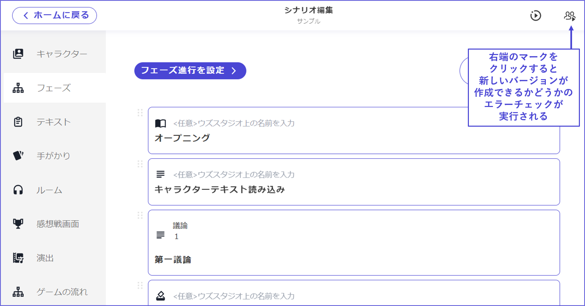

# Top Right Button: Create Latest Version

## How to Create the Latest Version

Once you have finished creating your scenario, first reflect the content in the app and conduct a test play. To do this, you need to follow the steps to create a version.

Pressing the **top right button** will automatically perform an error check to see if a new version can be created.

## Error Check and Correction

If there are any settings missing, **unconfigured areas will be displayed**, so please make the necessary corrections.

Clicking "**Go to the corresponding section**" will take you directly to the location of the error.

\

If everything is set up correctly, a popup for creating the version will appear.

The input field is a memo field for your own use to make it easier to check what was modified later. It is not visible to anyone other than the author, so feel free to fill it in. It's also okay to leave it blank.

#### ※What is the Latest Version?

The latest version is for test play and can only be created by the author; general users on the app cannot play this version.

In version 2, compared to version 1, there is more freedom, which means more settings and considerations, and it is more prone to implementation errors. To prevent a version with remaining errors from being released, it has become standard to create the latest version once. The latest version is displayed as "Latest Version" on the release management screen.

Pressing "**Release Latest Version**" on the release management screen releases it on the app as a version that general users can also play. For works transitioning from v1 to v2, **you cannot press "Release Latest Version"** until the transition application is approved.

For more about the "Release Management" screen where versions are managed, see [here](../scenariohome/release.md).
