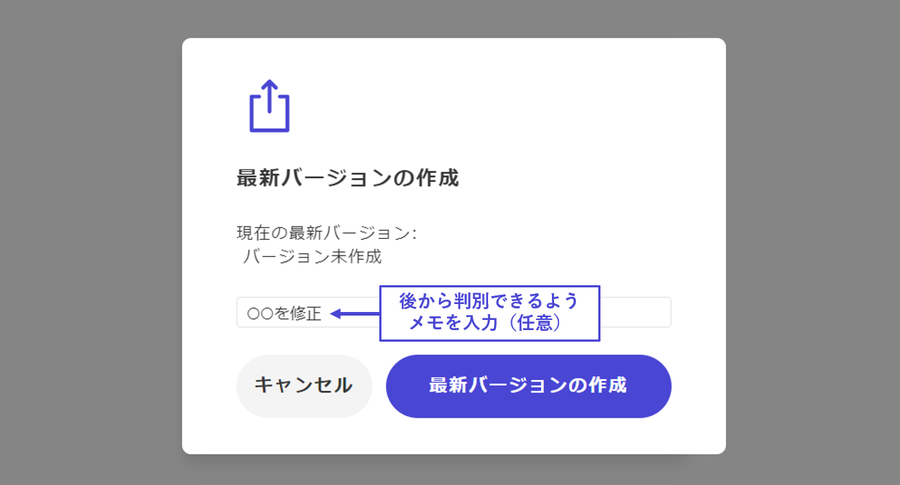

# 右上ボタン：最新バージョンを作成

## 最新バージョン作成の操作

シナリオの制作が終わったら、まずは制作した内容をアプリに反映してテストプレイを実施しましょう。そのために、バージョンを作成する手順を踏む必要があります。

**右上のボタン**を押すと、新しいバージョンが作成できるかどうかのエラーチェックが自動でおこなわれます。

## エラーチェックと修正

設定漏れがある場合は、**未設定箇所が表示**されるので、適宜修正してください。

「**該当箇所へ**」をクリックすると、エラーが出ている場所へ直接飛ぶことができます。

\

全て問題なく設定できていれば、バージョン作成のためのポップアップが出てきます。

入力欄は、何を修正したのかを後から確認しやすくするための自分用のメモ欄です。作者以外には見えないものなので、自由に記入してかまいません。また、空欄でも問題ありません。

#### ※最新バージョンとは？

作者だけがイベント作成できるテストプレイ用であり、アプリ上の一般ユーザーはプレイできないバージョンのことです。

v2では、v1に比べて自由度が高くなった分、設定箇所や考慮する部分が多くなっており、実装ミスが発生しやすいと考えられます。ミスが残ったままのバージョンが公開されてしまわないよう、一度、最新バージョンが作成されるようになっています。最新バージョンは、リリース管理画面で「最新版」と表示されます。

リリース管理画面から「**最新版をリリース**」を押すと、一般ユーザーも遊べるバージョンとしてアプリ上にリリースされます。v1→v2移行作品では**移行申請が承認されるまで「最新版をリリース」は押せない**ようになっています。

バージョンを管理する「リリース管理」画面については、[こちら](../scenariohome/release.md)で解説しています。

