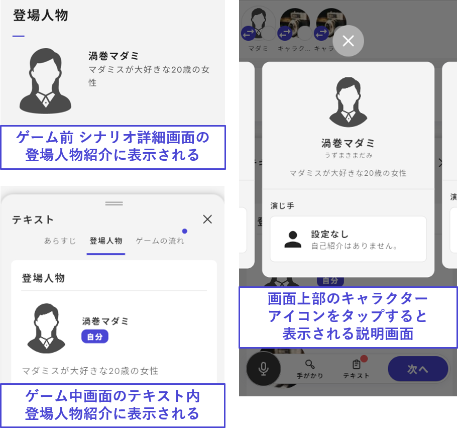

# Basic Character Information

This section explains how to set up the basic information for characters.

\\

## Basic Information

From the character list, click the **character you want to edit** to navigate to the character information settings screen.

The basic items for player characters are as follows. The icon and nickname can be changed based on conditions (see [later](basic.md#aikonnikkunmuno)).

| Item                     | Description                                                                    | Display Location in the UZU App                                                                                                   |
| ------------------------ | ------------------------------------------------------------------------------ | --------------------------------------------------------------------------------------------------------------------------------- |
| Official Name (Required) | Full name, etc.                                                                | Appears in the scenario details screen and character introduction during gameplay                                                 |
| Furigana (Optional)      | Furigana for the official name                                                 | Appears in the character introduction during gameplay                                                                             |
| Description (Required)   | Introduction of the character                                                  | Appears in the scenario details screen and character introduction during gameplay                                                 |
| Icon (Required)          | Character image                                                                | Displayed in the character introduction and read-along icon                                                                       |
| Nickname (Required)      | The name you want to be called in the game (e.g., only the last or first name) | Displayed below the character icon at the top of the screen during gameplay and as the displayed name during the read-along phase |

<figure><figcaption></figcaption></figure>

## Adding PC or NPC

To add a character, click "Add Character" in the top right of the list screen. When adding, choose either **Player Character** or **NPC**. For NPCs, you can select whether or not to display them in the "Character Introduction during gameplay" from the individual character editing screen.\\

Examples of characters to display:

- Victims
- Important NPCs in the story\\

Examples of characters not to display:

- NPCs known only to a few characters
- NPCs that only appear in the read-along, like a "detective"

\\

## Deleting a Character

To **delete** a character, press the "..." button at the top right of the individual character editing screen.

From the "..." button, you can also choose to "**Change to NPC**" or "**Duplicate Character**."

\\

## End Cards

You can set an end card for each player character.

The recommended size is "16:9" (width:height).

## Conditional Settings for Icon and Nickname

The icon and nickname displayed at the top of the screen during gameplay and in the read-along can be changed based on conditions.

For example, in the image, when "Ending 1" starts, it will be revealed that this character is actually "Phantom Thief UZU."

<figure><figcaption></figcaption></figure>
