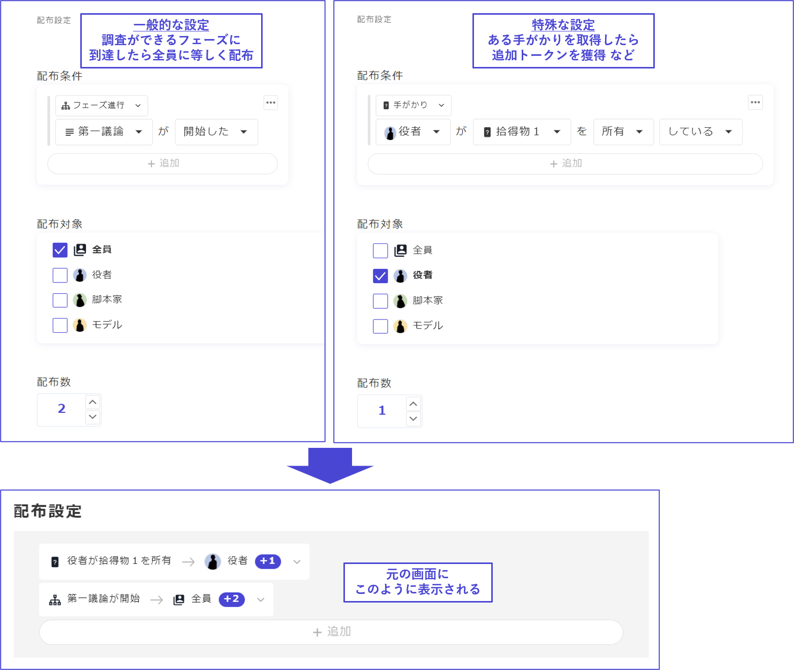
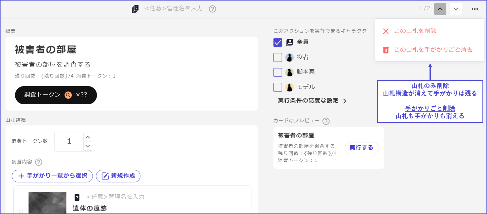
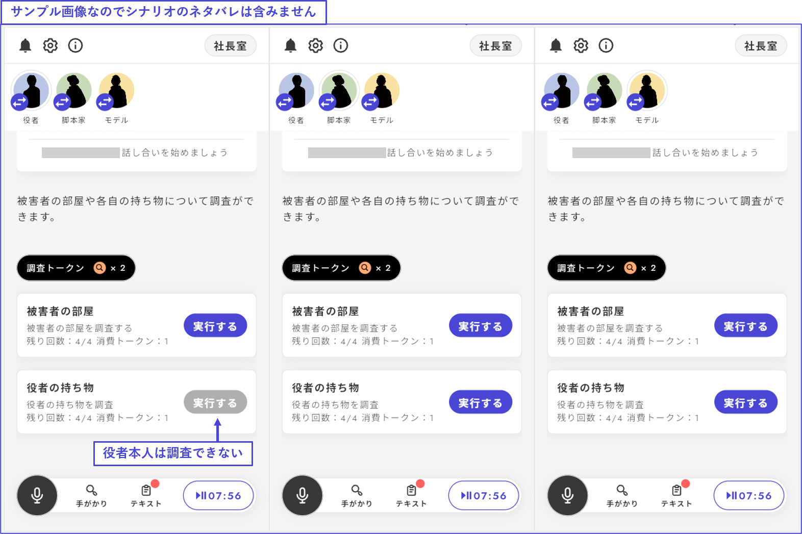

# Decks

In the deck, you can consume tokens to acquire clues.

## Creating Tokens & Decks

Since the premise in the deck is to consume tokens to obtain clues, it is necessary to configure the **tokens** first when creating the deck for the first time. Clicking on "Go to Token Settings" will take you to the token configuration screen.

<figure><figcaption></figcaption></figure>

\\

If the tokens are not yet set up, the screen will look like this, so please click "Create Token".

<figure><figcaption></figcaption></figure>

\\

Set up the token name, appearance, and distribution conditions. For example, if the investigation costs money, use a coin; if it takes time, use an hourglass.

It is also possible to set up multiple tokens according to the use case.

<figure><figcaption></figcaption></figure>

\\

For a normal investigation token that is **distributed equally to everyone**, it is a good idea to distribute a set number when a certain phase is reached.

Tokens that are distributed under special conditions, like when a certain clue is obtained or a certain option is voted on, can also be set up.

\\

After setting up the tokens, return to the "Decks" from the left menu.

From the "Add Deck" button, you can create a new deck.

<figure><figcaption></figcaption></figure>

\\

## Editing Decks

The basic items of a deck are as follows:

- **Title**
  - The title of the deck.
- **Description**
  - The description of the deck. Since the button used when utilizing the deck is fixed as "**Execute**," please write the description accordingly.
  - Do not include details about the remaining number of cards or the tokens consumed in the description, as these are displayed automatically.
- **Execution Conditions**
  - You can set the conditions for executing the deck. For example, you can make it so that certain characters cannot perform actions or that actions cannot be performed without specific clues.
- **Tokens Consumed**
  - You can set how many tokens are consumed when the deck is used.
  - The tokens are fixed per deck, not per clue.
- **Clues Included in the Deck**
  - You can set which clues to include in the deck. Any number of clues can be set.
  - If you have **already created clues**, select from the "List of Clues," and if you are **creating new clues**, click "Create New".
  - For each clue, you can set whether the character who draws the clue from the deck owns it or if it is made public to everyone. Ownership allows for public sharing or transfer at any time by the owner.
  - The distribution conditions for the clues included in the deck are automatically set to "when drawn from the deck," so **setting distribution conditions for each clue** is not necessary.

\\

There are two ways to delete a deck.

If you want to **dissolve the deck structure while keeping the clues included**, choose "Delete this deck." If you want to **erase both the deck and all the clues included**, select "Erase this deck along with the clues."

\\

## Placing Decks

Decks can be placed in the "**Basic**" phase. The basic phase can be identified by its icon.

From the list of phases, select the phase where you want to place the deck.

\\

Click the "Add" button in the phase details and select both "**Tokens**" and "**Deck Investigation**."

To allow viewing of each character's remaining tokens during the investigation, it is recommended to set up both "Tokens" and "Deck Investigation" during the phase that involves deck investigation.

\\

The actual screen during play looks like this:

In this example, since the actor cannot investigate their own props, the "Execute" button is disabled on the screen of the actor on the far left.

### Random Distribution of Decks

By default, decks distribute the clues in the list from top to bottom, but you can also set them to be distributed randomly.

The setting is simply done by checking "Obtain Randomly" in the "Order of Investigation Content" on the right side of the deck details screen.

<figure><figcaption></figcaption></figure>

※During web operation checks, pressing "Reset Play Status" does not shuffle the order; you need to close the tab of the operation check screen and launch the operation check again to shuffle the order.
