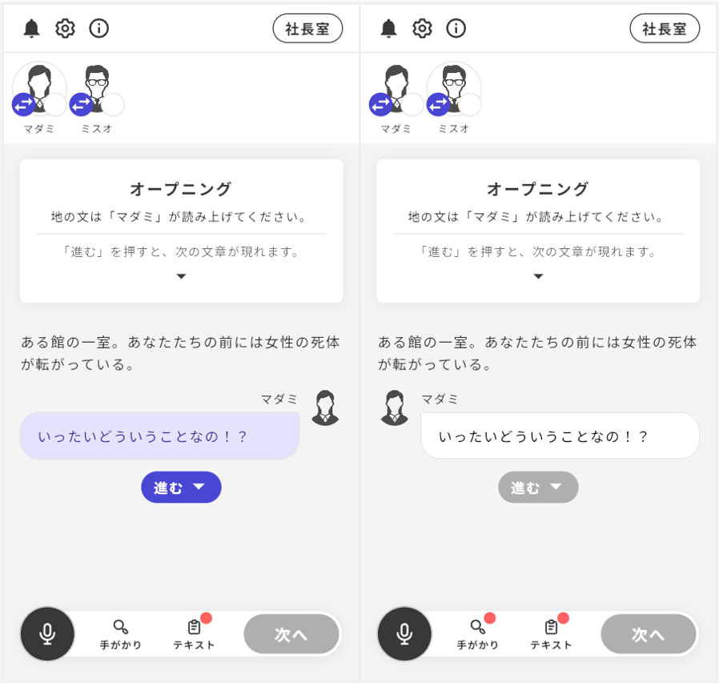

# Top-right Button: Operation Check

Before conducting a test play on the actual app, you can perform an operation check on UzStudio.

By clicking the "Play button" at the top right of the editor screen, an automatic check will be performed to see if the operation check can be conducted.

\

If there are any settings omitted, **the unset areas will be displayed**, so please make the necessary adjustments.

Clicking "**Go to the corresponding section**" will take you directly to the location of the error.

\

If all settings are complete, the screen will change and "**Proceed with operation check**" will be displayed, so please click on it.

\

You will perform the operation check while operating a screen almost identical to the app.

Background music and sound effects will also play.

