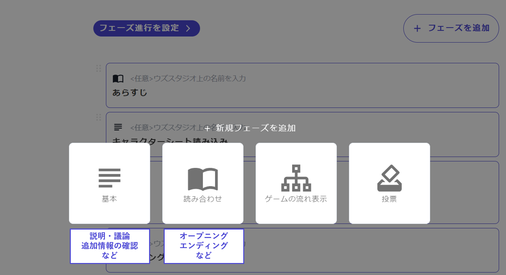

# Creating Phases - Overview

This section explains how to create phases.

First, click on "Add Phase" at the top right of the phase list screen.

\

You will then see a screen where you can choose from the following four types of phases. Select the appropriate type according to the content of the phase you want to create.

\

The characteristics of each phase type are as follows. Clicking on the type name will take you to a more detailed explanation page.

| Type Name                        | Capabilities                                               | Examples                                                                          |
| -------------------------------- | ---------------------------------------------------------- | --------------------------------------------------------------------------------- |
| [Basic](discussion.md)           | Display of text and images                                 | Character text loading, discussions, presentations, additional information review |
| [Read-through](script.md)        | Display of narration and dialogues                         | Openings, endings, intermissions                                                  |
| [Game Flow Display](timeline.md) | Display of the overall game flow and what phase comes next | –                                                                                 |
| [Voting](select.md)              | Display of options and voting                              | Culprit voting, pre-branch choices, selection of investigation locations          |
