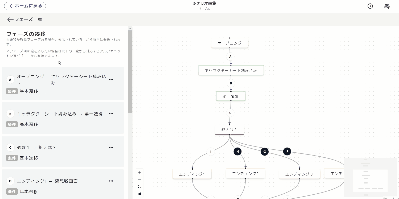
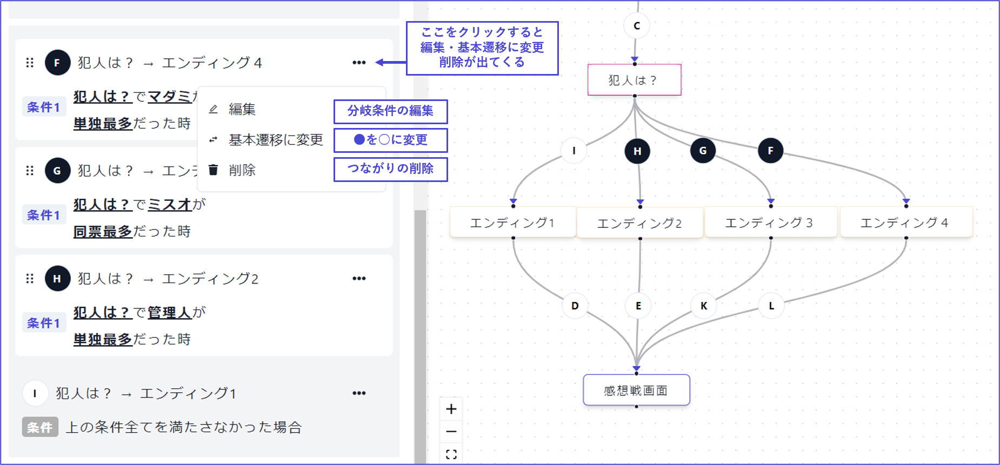

# Phase Progression

Phase Progression is the screen where you set the **order of the phases** and their **branching**.

From the left menu, select "Phases," and within that screen, click "Progression Settings" to move to the editing screen.

\

## Basic Operations

The basic operations are "arranging" and "connecting."

Phases can be connected as follows, allowing you to set which phase follows which. The alphabets written on the line correspond to the alphabets displayed on the left column.

If you want to reconnect an already connected line (transition) to a different place, find the corresponding alphabet from the left column and select **Delete** from the "..." menu.

_Note: If you are browsing on a smartphone, the left half will not display unless you hold it horizontally._

\

## Types of Transitions

There are two types of lines (transitions) between phases: "**Basic Transition**" and "**Conditional Transition**."

| Type of Transition     | Appearance              | Description                                                                                                              |
| ---------------------- | ----------------------- | ------------------------------------------------------------------------------------------------------------------------ |
| Basic Transition       | ○ White with black text | 
Transitions on tap or after a set time has passed If no conditional transitions apply, this transition occurs.
 |
| Conditional Transition | ● Black with white text | Transitions only if certain conditions are met.                                                                          |

\

Setting multiple lines (transitions) from one phase will always result in one being a "**Basic Transition**" and the rest as "**Conditional Transitions**." This can be visualized as branching from voting to an ending.

When there are multiple conditional branches, they are prioritized from top to bottom in the left column. The alphabets are just identifiers and do not indicate priority.

To set or delete transition conditions, press the "..." button.

You can also use a combination of "and" and "or" in nesting conditions. For more details, see [here](../condition.md#gurpu).

## Frequently Asked Questions

For frequently asked questions related to phase progression, see [here](../../QandA.md#phases)
