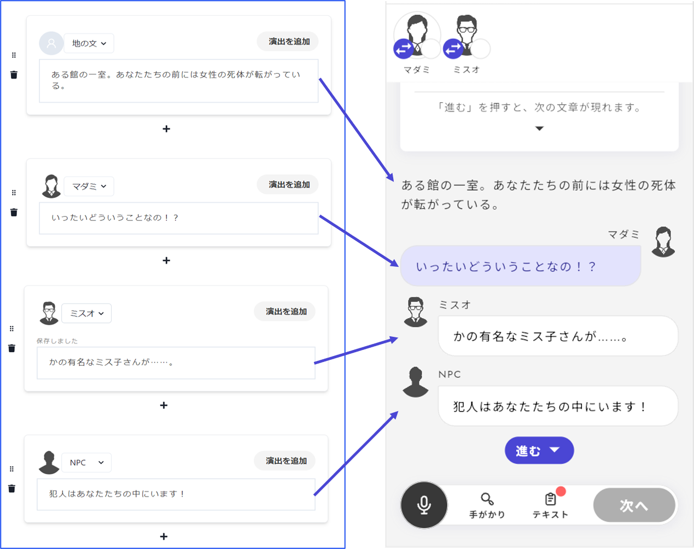

# Script Reading Phase

In the Script Reading Phase, you can set up **narrative text** and **dialogue**. This is ideal for scenes such as the opening, ending, or intermission where character interactions take place. \

## Basic Settings

The settings for basic elements such as the title or caption are the same as in the [Basic Phase](discussion.md). \

In v1, setting a "narrator" would automatically display the message "○○ will narrate" during the game screen, but in v2, you need to **include this as part of the subtitle or caption**. With this free-text input format, it is now easier to specify, for example, "○○ will narrate, and △△ will voice the NPC dialogue."

<figure><figcaption></figcaption></figure>

## Narrative Text & Dialogue

The correspondence between the editing screen in Uzustudio and the actual gameplay for narrative text and dialogue is as follows. In v2, dialogue spoken by your character is now color-coded.

- **Character Dialogue**
  - If set as the player character’s dialogue, it will display a speech bubble as if the character is speaking.
  - The person who presses “Continue” will be the character assigned to that dialogue.
- **NPC Dialogue**
  - If set as the NPC’s dialogue, it will display a speech bubble as if the character is speaking.
  - The person who presses “Continue” will be the character assigned as the "narrator" in Uzustudio.
- **Narrative Text**
  - If no character is assigned, it will appear as narrative text without anyone seeming to speak.
  - The person who presses “Continue” will be the character assigned as the "narrator" in Uzustudio.

## Adding Images to Dialogue

You can add images to dialogue sections in addition to text. For more details, see [image-script.md](../../advanced/image-script.md "mention"). \

## What is "Add Effects"?

The "Add Effects" button is explained in the [Effects](../bgm.md) section.

## Distributing the Phase Content as Text

If you want to **distribute the reading history to the Text tab** (so it can be referenced later), you can configure it from the menu on the right.

If you want to add **synchronized text** (which is not editable from the text side and automatically updates when the phase is edited): \
→ Just turn on "Distribute as text" under the phase recording options.

If you want to add **copied text** (which is editable from the text side and is a copy of the current phase content):

1. Press "＋ Add" in the distribution items.
2. Select "Text."
3. Open the distribution text field.
4. Select "Copy this phase."

In general, it's recommended to set it as the former, "synchronized text," during the Script Reading Phase.

<figure><figcaption></figcaption></figure>
