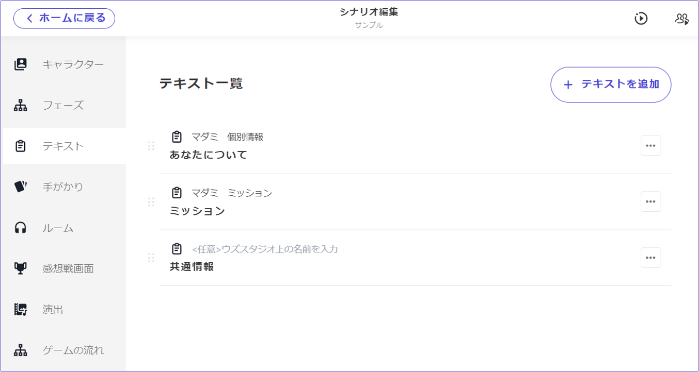
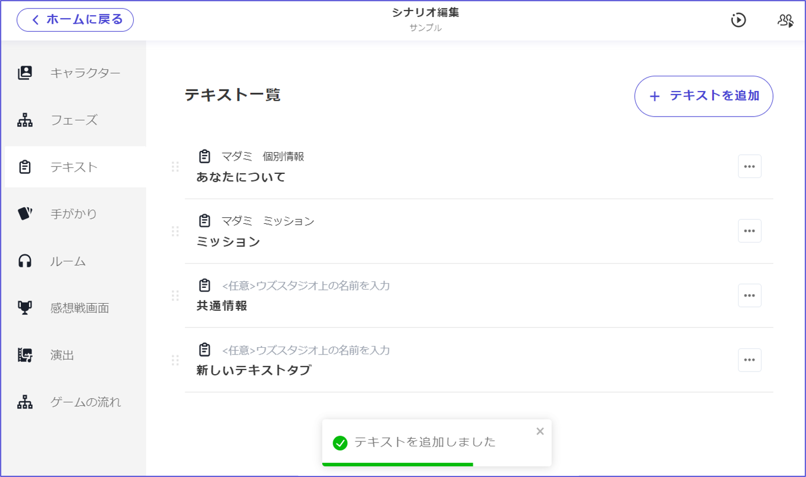
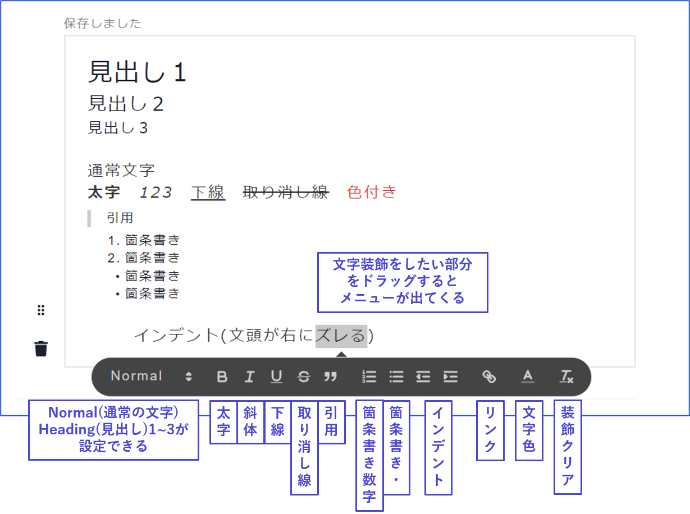
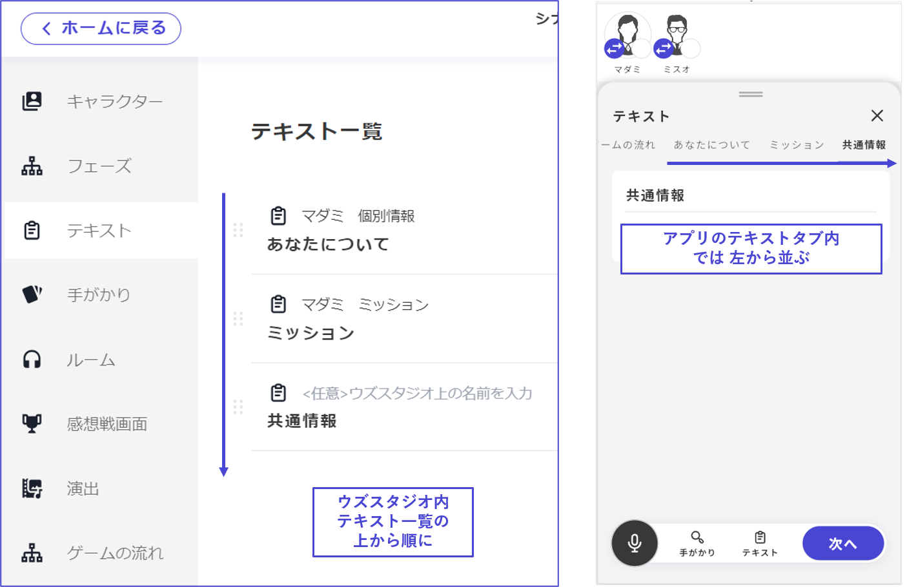

# Text

In the text settings, you can configure and edit texts that are distributed to the text tab during gameplay.

\

## Adding New Text

There are two ways to add new text:

\

### ① Add from the Text List

Click "**Add Text**" at the top right of the text list screen to create a "new text tab."

Clicking on the "new text tab" will take you to the editing screen for its content.

\

### ② Add from the Desired Phase

Add from the section labeled "Distributed Materials" on the right side of the phase editing screen.

Press the "Add" button at the bottom of the distributed materials, select "Text" from the types of materials you can add, set the text name and detailed conditions, and click "Save."

<figure><figcaption></figcaption></figure>

Additionally, tapping "Distribute as Text" at the bottom right of the screen will distribute a text completely synchronized with the content of the phase at the end of the respective phase. Use this for cases where, for example, you want to distribute the opening text at the end of the phase so it can be reread later.

\

## Contents of the Text Tab

In the text tab, you can include not only text and images but also dividers and speech bubbles.

Please add each from the add button. You can also rearrange their order later.

<figure><figcaption></figcaption></figure>

In texts, you can use the following types of text decorations:

\

For images, you can set **where to align the image** (left, center, right) and **how large** it appears.

<figure><figcaption></figcaption></figure>

Apart from basic conditions like distributing to "a specific character" when "reaching a specific phase," you can set **complex distribution conditions**. Utilize these for distributing **special information** or **additional information**.

You can also control the visibility of text and images based on characters and conditions. For more details, see [text-customize.md](../advanced/text-customize.md "mention").

\

## Display Order on the App

In Uzu Studio's text list, the order **from the top** corresponds to the order **from the left** in the text tab on the app.

Make sure to rearrange them in the order you want them to appear on the app.

