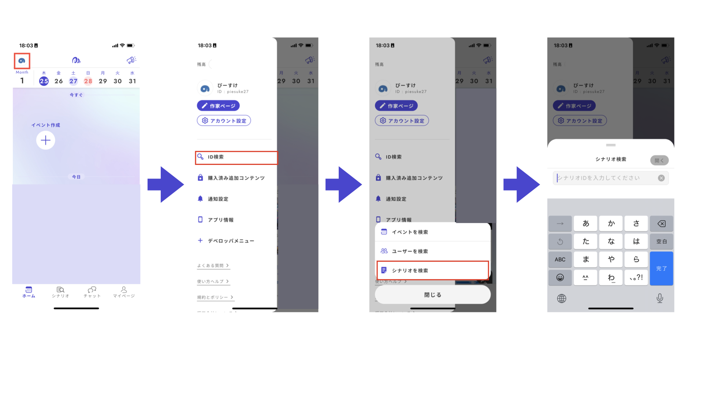

# Test Play

## Preparing for the Test Play

### ◆ Checking Functionality

Uz Studio has a feature that allows you to check the functionality of your scenario before conducting an actual test play in the app.

Since Uz Studio v2 allows for complex conditions and branching, errors are more likely to occur. If something doesn’t work as expected during functionality checks, it won’t work in the Uz app either.

By identifying and fixing game-breaking mistakes in advance, you can ensure a smoother test play. Always perform a functionality check in Uz Studio before conducting the test play.

Click the **play button in the top right** to move to the "functionality check" screen.

<figure><figcaption></figcaption></figure>

In the functionality check, you can view the scenario from start to finish in an interface almost identical to the app.

Screens for each player will be displayed side by side, simulating the view on a smartphone, allowing you to control all players by yourself. BGM and sound effects will also play.

<figure><figcaption></figcaption></figure>

It’s a good idea to check for the following common mistakes during the functionality check:



- Incorrect dialogue settings
- Mistakes in the distribution of text or clues and their conditions
- Errors in phase settings for secret talks
- Incorrect branching for endings based on voting
- BGM or sound effect settings errors
  

### ◆ Test Publishing

To conduct a test play in the Uz app, you need to **create the latest version**.

#### **① Click the Button in the Top Right**

When you press the "Create Latest Version" button in the top right, the scenario structure will be validated.

If there are no missing inputs or settings, the update will proceed. However, if there are missing inputs or settings, an error will be displayed. If this happens, check the indicated areas and make the necessary corrections.

<figure><figcaption></figcaption></figure>

#### ② Enter a Version Note

It’s helpful to leave a note about what changes were made or when the version was created. This is optional and can be left blank.

#### ③ Navigate to the Release Management Screen

When a success notification appears in the top right and you are taken to the Release Management screen, it means that creating the latest version (reflecting it in the app) has been completed.

### ◆ Creating a Test Play Event

A work that is test-published will not appear in the Uz app unless it is searched by its ID.

#### **① Copy the Work ID from the Release Management Screen**

Copy the work ID (an alphanumeric string) from the "Release Management" screen.

<figure><figcaption></figcaption></figure>

#### **② Open the Uz App**

#### **③ Search for the Scenario in the App**

- Tap the icon in the top left and select **"ID Search" → "Search Scenario"** from the menu bar.
- The scenario search screen will appear, so paste the scenario ID you copied in step ①.

<figure><figcaption></figcaption></figure>

#### ④ **The Scenario Details Screen Will Appear**

#### ⑤ **Create the Event**

- Tap "**Create Event with Latest Version**" at the bottom of the screen.
- Choose between "Play Now" or "Create a Scheduled Event" (specify date and time) and proceed to "**Event Settings**."
- Tap "**Allow Spectators**" and select "**Spectator**" for your participation slot.

<figure><figcaption></figcaption></figure>

#### ⑥ **Obtain the Shareable Link**

Once the event is created, you will see a screen like the one below. Click "Copy" to get the shareable link.

#### ⑦ **Send the Link to the Test Play Participants**


Since this event link takes users directly to the scenario's details page, which does not appear in the Uz app's search (as it hasn't been officially released), be careful when sharing the link in public forums like Twitter. Leaving the link publicly available can allow anyone to create an event and play the scenario before it is officially released.


## How to Conduct the Test Play

### ◆ Using Discord Alongside Uz

One method is to progress the game in Uz while communicating only via voice on Discord. Mute the audio in Uz and keep Discord audio on.


**Advantages**

- It's easier to create spaces for players to reflect (note-taking) during play.
  


**Disadvantages**

- You need to set up a Discord server.
- The procedure from event creation to execution becomes slightly more complex.
  

**【Discord Setup】**

- Create a Discord server for the test play and invite the participants.
- If the scenario includes secret talks, create voice channels for those.
- Create channels for each player to take notes.
- It’s also a good idea to send the Uz event participation link within the server.

**【Event Creation】**

- Create the event as mentioned earlier.
- The author can participate as a spectator in the Uz app or listen in on Discord without participating in the app.

### ◆ Completing the Process within Uz

This method involves the author participating as a spectator within the Uz app, without using Discord.


**Advantages**

- It’s simple to create and execute the event, as you only need to set up yourself as a spectator.
- You can view the play screen together with the players.
- Even as a spectator, you can unmute yourself and talk to the players, so if there’s any issue during play, you can provide additional explanations while watching the play screen.
  


**Disadvantages**

- There’s no space for players to take notes (reflection) during play.
  

**【Event Creation】**

- Create the event as mentioned earlier.
- The author should participate as a spectator in the Uz app.
