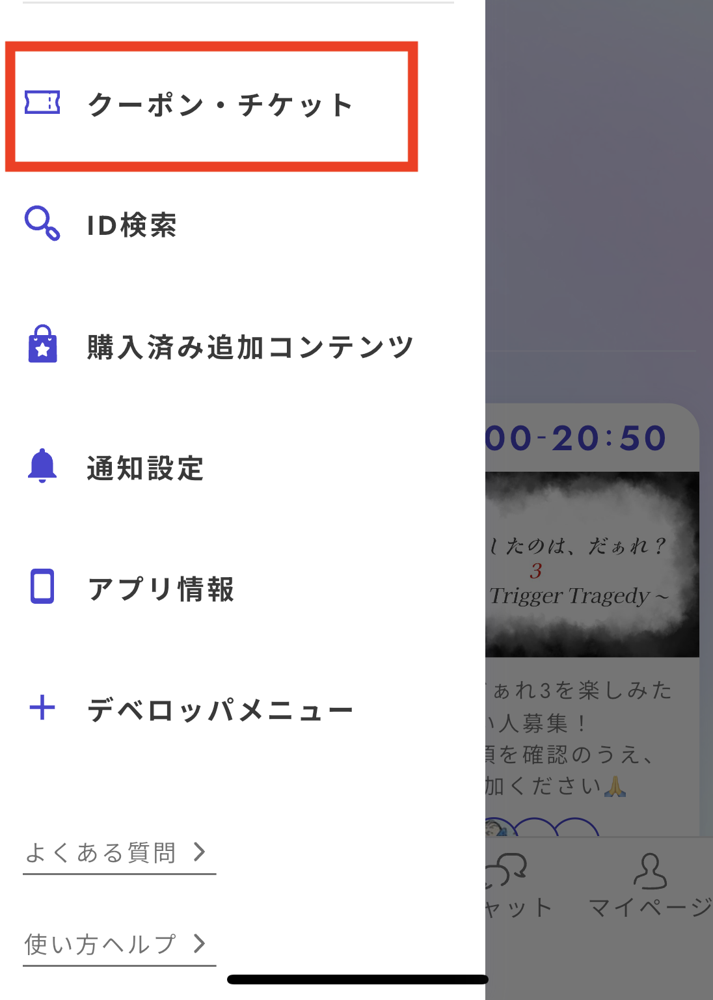

# Marketing

This is the screen where you can create and manage additional content and issue ticket codes.

## Creating and Managing Additional Content

### Basic Settings

You can create content that can be purchased after playing a scenario, such as epilogues or behind-the-scenes stories.

<figure><figcaption></figcaption></figure>

The price for additional content starts at 0 coins, with no upper limit.

The types of content that can be uploaded include the following:

- Images (png/jpg format)
- Videos (mp4 format)
- Audio (mp3 format)
- PDF documents
- Text editors that can be created within Uzu Studio

### Agreement to Terms

When publishing for a fee, please read the “Uzu Additional Content Paid Publication Terms.” All members entitled to receive revenue must agree to the terms, or the content cannot be published.

<figure><figcaption></figcaption></figure>

For collaborative works, revenue-sharing settings can be adjusted in the “Members” screen.

Revenue cannot be divided for different types of additional content individually. All content will follow a unified revenue-sharing ratio.

<figure><figcaption></figcaption></figure>

### Display in the App

The following images show how additional content is displayed in the app. You can confirm this on devices updated to version 3.50.0 or higher.

<figure><figcaption></figcaption></figure>

<figure><figcaption></figcaption></figure>

<figure><figcaption></figcaption></figure>

## Issuing Ticket Codes

For paid scenarios, you can issue a code that allows others to play your scenario for free in exchange for a ticket. This is useful when you want someone to play your scenario and write a review or when running a campaign.

This feature can also be used to allow free access for test plays during the v2 transition of paid works.

### Basic Specifications

- Each code can only be used once. **If you test the code on your own account, others won’t be able to use that ticket, so be careful.**
- You can issue up to 3 tickets per character in the scenario at one time. The number of available tickets resets on the first of every month.
- You will not receive any revenue from people who use the ticket to play for free.

### How to Issue Tickets

Go to the “Marketing” tab on the scenario details screen and tap “Issue New Code.”

<figure><figcaption></figcaption></figure>

After pressing the button, a screen like the one below will appear, and a code will be issued. You can then give this code to the person you want to play your scenario. Please note that each code can only be used once.

<figure><figcaption></figcaption></figure>

### How to Use Tickets in the App

From the side menu, press “Coupons & Tickets.”

<figure><figcaption></figcaption></figure>

Enter the coupon code you issued earlier, and the corresponding free ticket for the scenario will be added to the "Ticket List."

<figure><figcaption></figcaption></figure>

Once the ticket has been redeemed, Uzu Studio will display the following screen, showing who has redeemed the ticket.

<figure><figcaption></figcaption></figure>

### User Instructions Page

There is a user instruction page explaining how to use tickets. You can send this link along with the ticket code to the recipient:

- [https://www.uzu-app.com/articles/free-play-ticket](https://www.uzu-app.com/articles/free-play-ticket)

### Stealth Marketing Warning

Stealth marketing refers to promoting or advertising products or services without disclosing that it is, in fact, an advertisement or promotion. Starting in October 2023, this practice is regulated as misleading advertising under the Act against Unjustifiable Premiums and Misleading Representations.

**Examples of What to Watch For**

- Asking someone to leave a positive review without disclosing they played with a free ticket.
- Requesting promotion without revealing it was a sponsored play.

**Best Practices**

- Do not force positive reviews or promotion.
- Ask players to mention if they participated in a campaign or used a free ticket when posting a review.
- Ensure articles and reviews explicitly mention if they are advertisements or promotions.

Search for terms like "stealth marketing" or "stealth marketing law" for more information.
