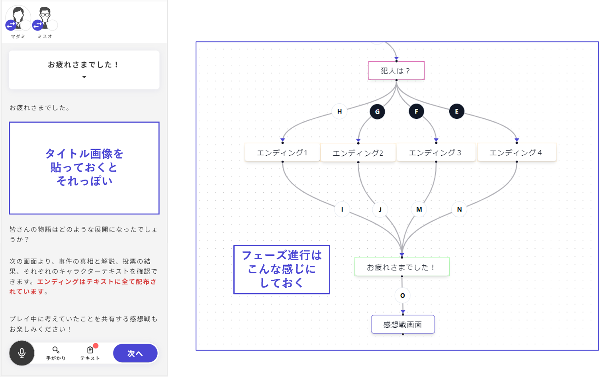

# 全てのエンディングを配布したい

v1では全てのエンディングが感想戦で強制的に開示されていましたが、v2では通過していないエンディングを見せるかどうかを作者側で設定できるようになりました。

全てのエンディングを感想戦画面で確認できるようにする方法を説明します。

\

## 方法１：お疲れさまでした画面で配布する

**①お疲れさまでしたフェーズを追加する**

フェーズ一覧画面から「フェーズを追加」をクリックし、「基本」フェーズを選んで作成すると良いでしょう。

フェーズの内容は自由に設定してください。

\

**②お疲れさまでしたフェーズを感想戦画面の１つ手前に設置**

フェーズ一覧画面から「フェーズ進行を設定」と進み、①で追加したフェーズを「感想戦画面」の１つ手前に差し込みます。

\

**③エンディングをテキストにも配布する**

フェーズ一覧から、エンディングフェーズそれぞれの編集画面に行き、「フェーズ内容の記録」の「テキストとして配布」にチェックを入れます。

<figure><figcaption></figcaption></figure>

**④配布のタイミングを変更**

テキスト一覧から、③で追加したエンディングテキストそれぞれの編集画面に行き、配布するフェーズを「お疲れさまでした」に変更します。

<figure><figcaption></figcaption></figure>

\

## 方法２：または設定で配布する

**①エンディングをテキストにも配布する**

フェーズ一覧から、エンディングフェーズそれぞれの編集画面に行き、「フェーズ内容の記録」の「テキストとして配布」にチェックを入れます。

<figure><figcaption></figcaption></figure>

\

**②配布のタイミングを追加する**

条件を「〇〇が終了した時」に変え、他の全てのエンディングを配布のタイミングとして追加していきます。

条件同士の関係は「または」にしておきましょう。

<figure><figcaption></figcaption></figure>

\

## 方法３：感想戦画面に転記する

**①感想戦画面に「他のエンディング」といったタブを追加する**

**②タブ内にエンディングを転記する**

<figure><figcaption></figcaption></figure>
