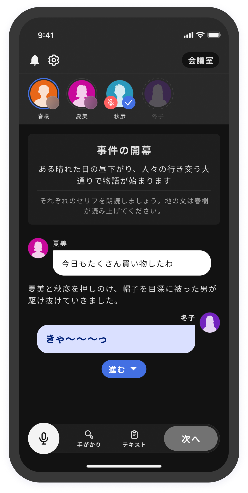
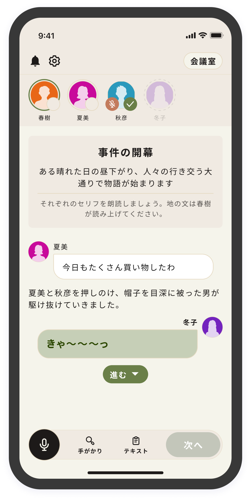
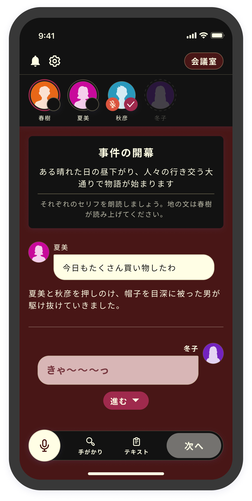
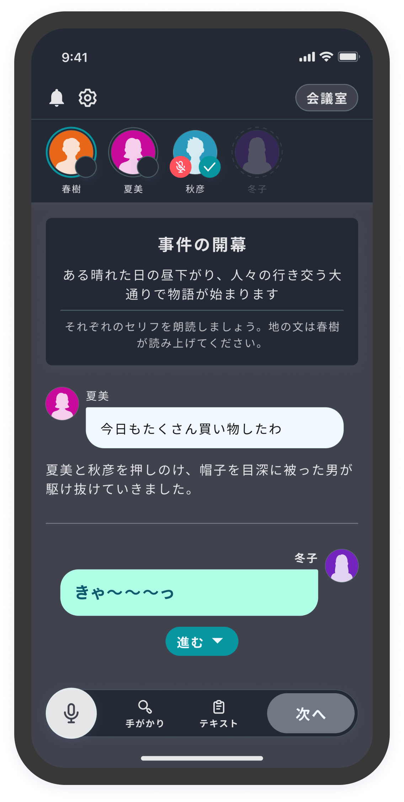
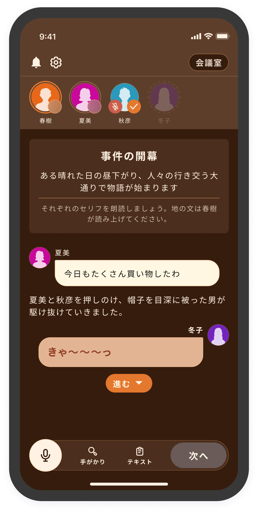
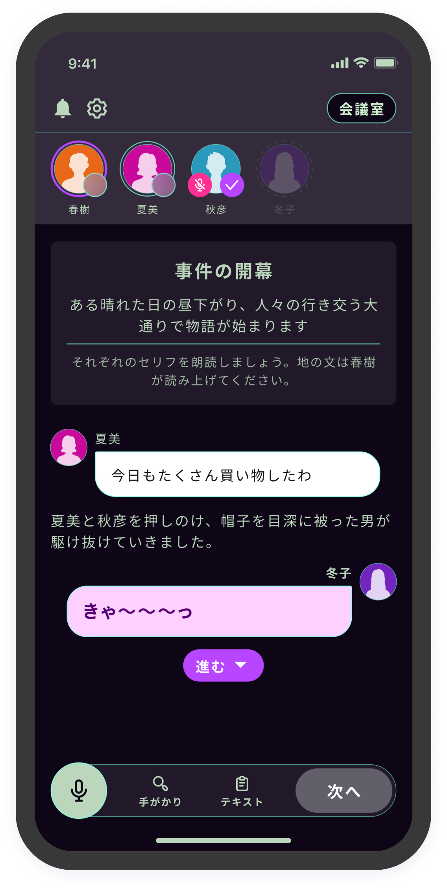
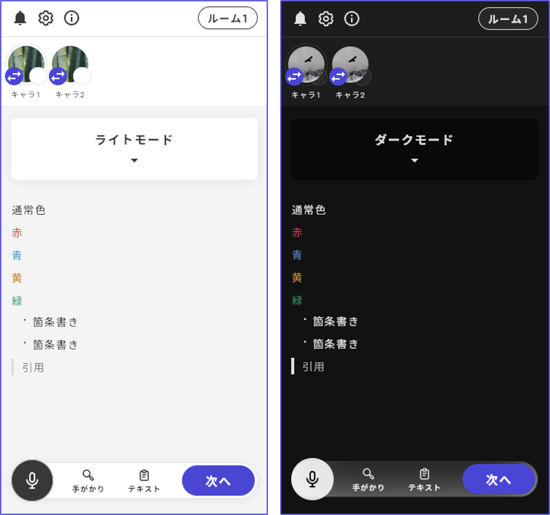

# カラーテーマ

カラーテーマページからカラーテーマの設定ができます。

<figure><figcaption></figcaption></figure>

<figure><figcaption></figcaption></figure>

テーマは2024/01/12 現在で以下の種類が使用できます。

<table data-view="cards"><thead><tr><th></th><th></th><th></th></tr></thead><tbody><tr><td><strong>ライト</strong></td><td></td><td></td></tr><tr><td><strong>ダーク</strong></td><td></td><td></td></tr><tr><td><strong>マリン</strong></td><td></td><td></td></tr><tr><td><strong>アンティーク</strong></td><td></td><td></td></tr><tr><td><strong>ドリーム</strong></td><td></td><td></td></tr><tr><td><strong>モダン</strong></td><td></td><td></td></tr><tr><td><strong>メカニカル</strong></td><td></td><td></td></tr><tr><td><strong>ノスタルジア</strong></td><td></td><td></td></tr><tr><td><strong>サイバーパンク</strong></td><td></td><td></td></tr></tbody></table>

シナリオの途中でカラーテーマを切り替えるようになる機能は将来的に実装予定です。

文字色は自動で最適化されるので、モードに合わせて変える必要はありません。

