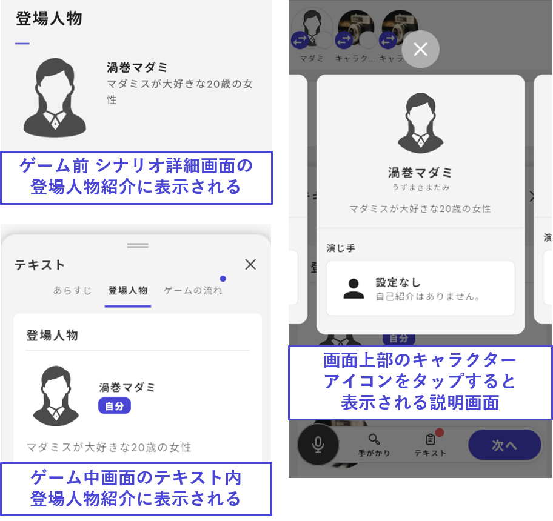

# キャラクターの基本項目

キャラクター基本情報の設定について説明します。

\\

## 基本項目

キャラクター一覧から**編集したいキャラクター**をクリックすると、キャラクター情報の設定画面に移動します。

プレイヤーキャラクターの基本項目は以下の通りです。アイコンとニックネームは条件によって変更することができます（※[後述](basic.md#aikonnikkunmuno)）。

| 項目         | 内容                      | ウズアプリで表示される場所                    |
| ---------- | ----------------------- | -------------------------------- |
| 正式な名前(必須)  | フルネームなど                 | シナリオ詳細画面・プレイ中画面の登場人物紹介           |
| ふりがな(任意)　　 | 正式な名前のふりがな              | プレイ中画面の登場人物紹介                    |
| 説明文(必須)    | キャラクターの紹介文              | シナリオ詳細画面・プレイ中画面の登場人物紹介           |
| アイコン(必須)   | キャラクター画像                | 登場人物紹介や読み合わせのアイコン                |
| ニックネーム(必須) | 姓のみ・名前のみなどプレイ中に呼んでほしいもの | プレイ中の画面上部キャラクターアイコンの下・読み合わせ中の表示名 |

<figure><figcaption></figcaption></figure>

## PC・NPCの追加

キャラクターの追加は一覧画面の右上「キャラクターを追加」からおこないます。追加の際に**プレイヤーキャラクター**か**NPC**かを選びます。 NPCの場合は、キャラクター個別の編集画面で「プレイ中の登場人物紹介に表示するかどうか」を選択できます。\\

表示するキャラクターの例

* 被害者
* ストーリー上で重要なNPC\\

表示しないキャラクターの例

* 一部のキャラクターのみが存在を知っているNPC
* 読み合わせでしか登場しない「刑事」のようなNPC

\\

## キャラクターの削除

キャラクターを**削除したい**ときはキャラクター個別の編集画面の右上「・・・」を押してください。

「・・・」ボタンからは削除の他に「**NPCへの変更**」「**キャラクターの複製**」ができます。

\\

## エンドカード

プレイヤーキャラクターそれぞれにエンドカードを設定できます。

推奨サイズは「横16：縦9」です。

## アイコン・ニックネームの条件設定

プレイ中の画面上部と読み合わせ中に表示されるアイコン・ニックネームは条件によって変更することができます。

例えば画像の例では、エンディング１が開始するとこのキャラクターは「怪盗ウズ」であったことが明かされるようになっています。

<figure><figcaption></figcaption></figure>
