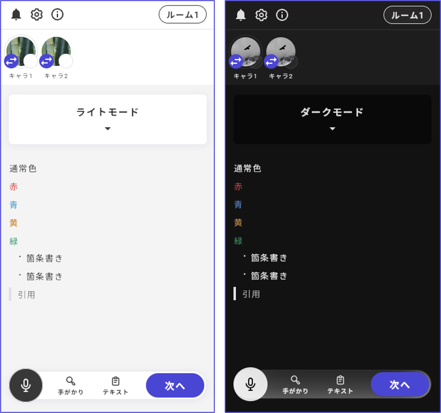

# カラーテーマ

カラーテーマページからカラーテーマの設定ができます。

<figure><figcaption></figcaption></figure>

<figure><figcaption></figcaption></figure>

テーマは2024/01/12 現在で以下の種類が使用できます。

<table data-view="cards"><thead><tr><th></th><th></th><th></th></tr></thead><tbody><tr><td><strong>ライト</strong></td><td></td><td></td></tr><tr><td><strong>ダーク</strong></td><td></td><td></td></tr><tr><td><strong>マリン</strong></td><td></td><td></td></tr><tr><td><strong>アンティーク</strong></td><td></td><td></td></tr><tr><td><strong>ドリーム</strong></td><td></td><td></td></tr><tr><td><strong>モダン</strong></td><td></td><td></td></tr><tr><td><strong>メカニカル</strong></td><td></td><td></td></tr><tr><td><strong>ノスタルジア</strong></td><td></td><td></td></tr><tr><td><strong>サイバーパンク</strong></td><td></td><td></td></tr></tbody></table>

文字色は自動で最適化されるので、モードに合わせて変える必要はありません。

### 設定したタイミングでカラーテーマが変わらない？ 

カラーテーマ設定画面の上から順に、「ライト：フェーズ１が開始した」、「ダーク：フェーズ２が開始した」というテーマを設定しているとします。

フェーズ２開始時点でライトからダークに変わってほしいですが、この設定では変わりません。

フェーズ１→フェーズ２と進んだ場合、「フェーズ１が開始した」という条件はフェーズ２が開始しても満たしていることになるからです。条件は、より上にある画像が優先なので、ライトの条件が満たされている限りずっと、ダークには変わりません。

改善方法

* ライトの条件を「フェーズ１が進行中」に変える
* ライトの条件を「フェーズ１が開始した　かつ　フェーズ２が踏まれなかった」に変える
