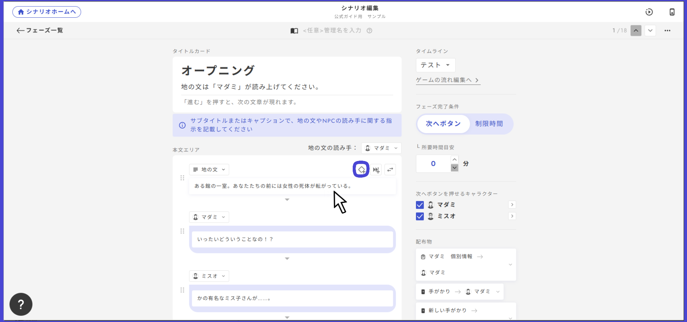
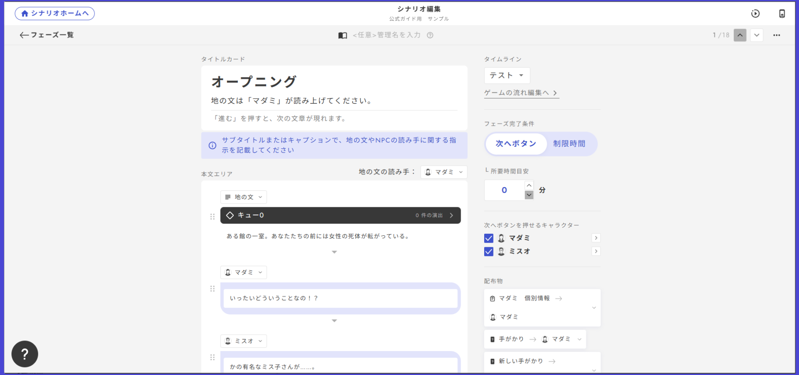
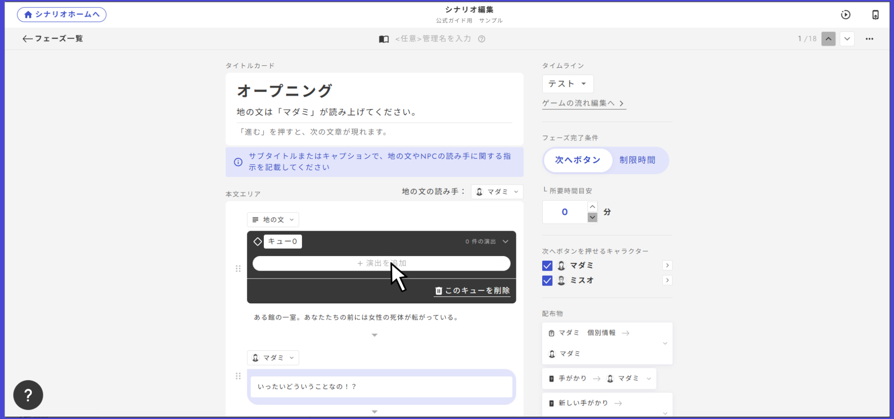
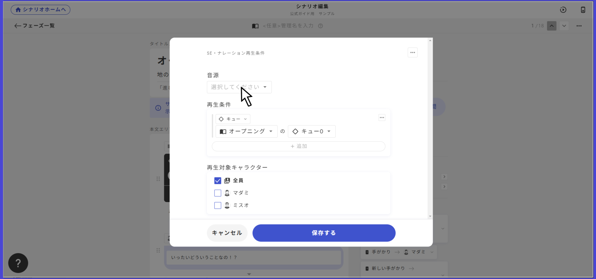

# SE・ナレーション

SE・ナレーションは、効果音や読み合わせフェーズのナレーションなど、一度しか流さない音声を再生する時に使います。

<figure><figcaption></figcaption></figure>

### 再生条件の設定

SEはBGMと違って一度きりの再生を想定しているため、停止条件は存在しません。

「再生条件を追加」から再生条件を設定して、その条件が満たされた時に一度だけ音声が再生されます。

条件は複数設定できて、その条件が満たされるたびに再生されます。

### 読み合わせフェーズでの再生設定

読み合わせフェーズの途中で音声を再生したい場合には、「キュー」の設定を行います。

キューは、読み合わせフェーズのそれぞれのセリフから行うことができます。

<figure><figcaption></figcaption></figure>

セリフにカーソルを合わせるとダイヤマークが出現します。このダイヤマークをクリックすることでキューを作成することが出来ます。

<figure><figcaption></figcaption></figure>

黒いバーにキューと書かれていれば作成することが出来ています。キューの後ろについている数字はキューを管理している数字です。

このキューの名前は自由に変更することが出来ます。自分の覚えやすい名前にしてもかまいません。

<figure><figcaption></figcaption></figure>

SEを追加したいときはこの黒いバーをクリックして「演出を追加」をクリックします。するとBGMとSEのどちらかを選択することが出来るようになります。今回はSEを追加したいためSEを選択しましょう。

<figure><figcaption></figcaption></figure>

選択すると再生の設定を行うことが出来るようになります。ここで、流したい音源を選択しましょう。\
ほかにも特定の条件でのみSEを流すことや、特定のキャラクターにのみSEを流すことが可能です。
