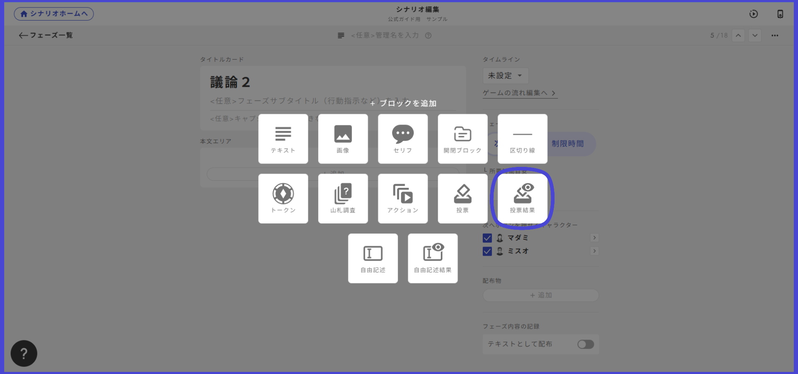
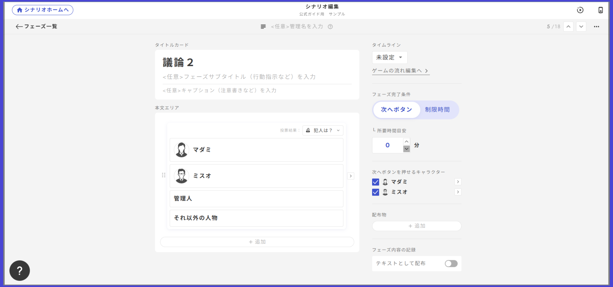
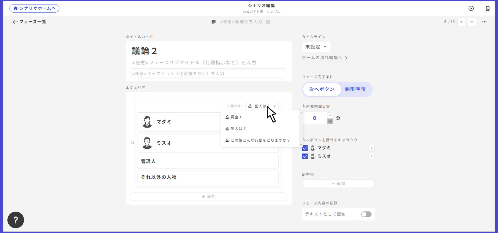

# 投票フェーズの作り方

投票フェーズでは、犯人投票をはじめとした様々な投票を行うことができます。&#x20;

元々は投票専用の独立したフェーズとなっていましたが、2024年10月のアップデートにより、「基本」フェーズの中に投票用ボックスを置く形に変わりました。投票フェーズの基本的な作り方は4つのステップに分かれます。

①フェーズ一覧右上の「フェーズを追加」から「基本」フェーズを作成

②フェーズ内の追加ボタンから「投票」を選択

③プレイヤーには見えない管理名と、選択肢を入力して投票ボックスを作成

④「＞」ボタンから詳細編集画面に行き、投票条件・投票できる人・票数などの細かい条件を設定

<figure><figcaption></figcaption></figure>

投票ボックスの設定項目とアプリ内での見え方について説明します。

## 投票の選択肢

選択肢の名前や画像を設定します。編集画面に行く際は「＞」ボタンをクリックします。

画像がある場合とない場合の表示の違いは以下のサンプルの通りです。

<figure><figcaption></figcaption></figure>

フェーズ完了条件について

次へボタン：投票先を選択しないと「次へ」を押せない状態になります。投票のあるフェーズではこちらがおすすめです。

制限時間：投票先を選択していなくても、設定したタイマーが0秒になったら次へ進んでしまいます。投票のあるフェーズで制限時間を設定する場合は注意してください。

## 投票できるキャラクター

該当の投票フェーズで投票できるキャラクターを設定します。ここで特定のキャラクターを設定すると、そのキャラクターしか投票を行うことができません。代表者一人に投票を行わせたい場合などに有効です。

<figure><figcaption></figcaption></figure>

## 投票を閲覧できるキャラクター

該当の投票フェーズの投票内容を閲覧できるキャラクターを設定します。この設定をONにしたキャラクターの画面では、誰がどこに投票したのかがアイコンで示されます。重複投票を回避したい場合に有効です。

<figure><figcaption></figcaption></figure>

## 投票結果の表示方法

投票結果とは、ある投票フェーズで誰がどの選択肢に投票して、各選択肢に何票集まったのかを示す画面です。

<figure><figcaption></figcaption></figure>

​追加したいフェーズの本文エリアから追加を選択し、投票結果を選択します。

<figure><figcaption></figcaption></figure>

表示したい投票結果を変更する場合、投票の管理名をクリックするとプルダウンが出現します。

<figure><figcaption></figcaption></figure>

ここから自分の見せたい投票を選択することで切り替わります。

感想戦画面に表示させたい時は[こちら](../result.md#vote)をご覧ください。\
 

基本フェーズ、テキストタブ、手がかり、感想戦で投票結果を設置できるようになりました。\
※投票が行われる前でも関係なく投票結果は表示されます。 例えば、投票結果をテキストで確認させたい時に最初からテキストタブが表示されるようにしていると投票の選択肢が事前に分かってしまう、といったことが起きます。そのような場合には、表示条件等を使って投票前に投票結果が表示されないようにすることをおすすめします。

## 投票の選択肢

それぞれの選択肢に「表示条件」と「選択条件」を設定することができます。

「表示条件」は、ある特定の条件を満たしたときのみ、その選択肢が現れるようにする設定です。条件を満たしていないときは全キャラクターの画面で完全に非表示になるのが特徴です。 あるフェーズに辿り着いている時、ある手がかりを持っている時といった条件と相性が良いでしょう。

<figure><figcaption></figcaption></figure>

「投票条件」は、ある特定の条件を満たしたときやあるキャラクターのみ、その選択肢に投票できるようにする設定です。 投票できない選択肢は薄い色で表示されます。

<figure><figcaption></figcaption></figure>

同じ選択肢に2人以上が投票できないようにすることもできます。主に、投票と手がかりを組み合わせて調査フェーズを作りたい方向けの機能になります。調査フェーズの作成について、より詳しく知りたい方は、[こちらのページ](../../../../advanced/investigation.md)をご参照ください。

<figure><figcaption></figcaption></figure>

## 複数票設定

一人に複数票持たせる、条件を満たしたものだけに複数票持たせるといった設定もできます。

<figure><figcaption></figcaption></figure>

## フェーズ全体の編集

投票ボックス以外の部分には、基本フェーズで設置できる、テキスト・画像・セリフ・山札・アクションなどを何でも置くことができます。

また、他の設置物と同様に、投票ボックス自体に表示条件をかけることができます。下の例では、キャラクター1にしか見えない投票ボックスを設置しています。

<figure><figcaption></figcaption></figure>

## 2つ以上の投票を設置するとき

1つのフェーズ内に2つ以上の投票を設置するときは、それぞれ何の投票なのかをテキストで書くのを忘れないようにしてください。

<figure><figcaption></figcaption></figure>

