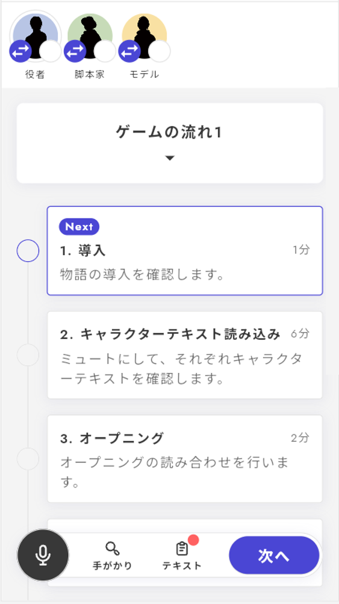

# ゲームの流れ表示フェーズ

ゲームの流れフェーズとは、オープニングがあって、キャラクターテキスト読み込みがあり、議論をして、投票へ進み、エンディングといった**シナリオ全体の流れ**を示すフェーズです。プレイヤーが今どこのフェーズにいて、次はどのフェーズに進むのかを把握するものでもあります。

v1では、全てのフェーズとフェーズの間で自動的にゲームの流れが表示されていましたが、v2ではどこで表示するかを選べるようになりました。流れを止めたくないフェーズの間には入れずに進めることができます。

\\

ゲームの流れフェーズは、各ゲームの流れフェーズの詳細画面から設定することが出来ます。

<figure><figcaption></figcaption></figure>

### 基本項目

基本項目は「フェーズ名」「フェーズの説明」「フェーズの所要時間」です。

それぞれ以下のように表示されます。

<figure><figcaption></figcaption></figure>

### 対応するフェーズ（必須）

作成したゲームの流れそれぞれに対応するフェーズをタイムライン未設定フェーズから選びます。

１つの表示に**複数のフェーズ**をまとめて設定することもできます。フェーズの並び順が変更出来ますが並び順には特に関係はありません。

### 表示条件（任意）

特定の項目をいつまで**非表示**にしておき、いつから表示するかを設定することができます。

あるエンディングを通過したときにしか現れない秘密のフェーズがある場合、ゲーム序盤では明かされていない追加議論がある場合などに有効です。

オープニング、キャラクターテキスト読み込み、通常議論など、非表示にしておく必要のないフェーズでは設定しなくてよいでしょう。

<figure><figcaption></figcaption></figure>
