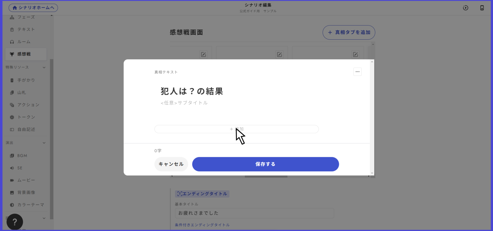
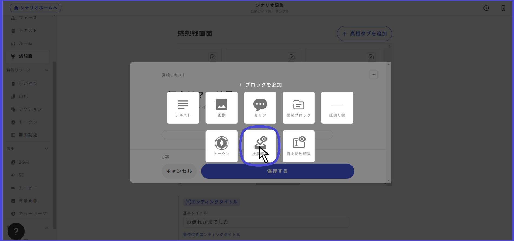

# 感想戦画面

感想戦画面とは、議論・投票・エンディングなど全てが終わった後に表示される解説・結果画面です。

<figure><figcaption></figcaption></figure>

## タブの内容

タブに入力できる内容は「タイトル」「説明」「本文」の３つです。

タブの内容はそれぞれのタブの右上をクリックすると編集できます。

<figure><figcaption></figcaption></figure>

アプリ上の画面との対応は以下の通りです。

<figure><figcaption></figcaption></figure>

## タイトルの出し分け

感想戦画面の一番最初に表示されるタイトルを条件に沿って出し分けることができます。

基本的に「基本タイトル」の部分のみ記載しておけば問題はないですが、「条件付きエンディングタイトルを追加」を押すと複雑な出し分けを行うことができます。

<figure><figcaption></figcaption></figure>

### タブの並び替え

タブを長押しして他のタブと表示順を入れ替えることができます。

### 投票結果を表示 

投票機能は犯人投票だけでなく、調査や個別目標の達成判定など様々な場面で利用できますが、シナリオ内で設けた投票のうち、感想戦画面で結果を表示するものを選ぶことができます。

<figure><figcaption></figcaption></figure>

投票を追加したい真相タブを開き、追加をクリックします。

<figure><figcaption></figcaption></figure>

投票結果を選択することにより、投票結果をプレイヤーが閲覧できるようなります。

### 未取得の手がかり一覧を表示

タブ一覧の一番右にある「未取得の手がかり一覧」というタブのトグルをonにすると、感想戦のタブ一覧の最後に、そのイベントで誰にも取得されなかった手がかりの一覧が表示されます。

<figure><figcaption></figcaption></figure>
