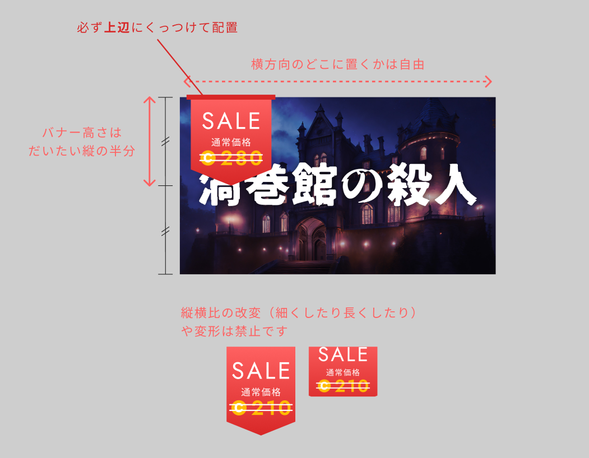

# プレイ料金・セールの設定

プレイ料金およびセールの設定はウズスタジオではできません。プレイ料金はリリース時に入力するフォームにて回答、プレイ料金の変更やセールは個別チャンネルにて運営にご連絡いただく必要がございます。


セールの設定依頼の際は

* セール開始日・終了日
* 以下のセール規定に沿ったセール時のプレイ料金（70コイン＝100円単位がオススメ）

をお知らせください。

※セールにより有料作品のプレイ料金を無料にすることはできません。



【セール規定】

ウズでは不当な低価格競争の防止のため、セール規定を設けております。

* セール料金：その作品が設定できる最低料金－100円(70コイン)まで
  * 最低料金は審査申請フォーム、公開準備用フォームに記載がございます。不明な場合は運営チームにご質問ください。\

* セール期間：最大1か月(翌月の同日)まで
* セール間隔：以前のセール終了から最低1か月は空けること\
  ※運営主導の一斉セールと被る場合はその限りでない


## セールの適用範囲

実際にシナリオをプレイする日とは関係なく、エントリー時点のプレイ料金が個別に適用されます。

例えば、通常価格が500円で、1/1 0時から1/5 0時まで400円で販売をする場合

* 1/3に遊ぶシナリオに12/31にエントリーした人→500円
* 1/3に遊ぶシナリオに1/1にエントリーした人→400円
* 1/10に遊ぶシナリオに1/4にエントリーした人→400円
* 1/10に遊ぶシナリオに1/6にエントリーした人→500円

のようになります。

## セール中の表示

以下のようなセールバッジをキービジュアルにつけていただくことができます。

運営では個別対応しておりませんので、ご希望の方は[こちら](../resource/sale-badge.md)から素材をダウンロードしてご利用ください。

<figure><figcaption></figcaption></figure>

セールを行う場合、セールの終了期限をシナリオ説明などに記載しておきましょう。

<figure><figcaption></figcaption></figure>

