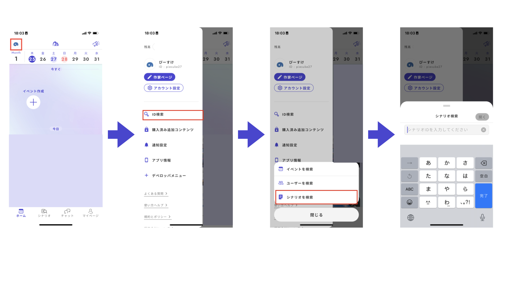

# テストプレイ

## テストプレイ前準備

### ◆動作確認

ウズスタジオには、アプリで実際にテストプレイをする前に動作の確認ができる機能があります。

ウズスタジオv2では複雑な条件や分岐を設定できる分、ミスも発生しやすくなっています。動作確認で想定通りに動かないものはウズアプリ上でも動きません。

ゲームが破綻するようなミスを事前に見つけて修正できるので、テストプレイの実施前には必ずウズスタジオで動作確認を行いましょう。

**右上の再生ボタンをクリック**すると「動作確認」の画面に移動します。

<figure><figcaption></figcaption></figure>

動作確認では、アプリとほぼ同じ画面でシナリオを最初から最後まで通して見ることができます。

プレイヤーの人数分、スマートフォンを想定した画面が並んで表示されるので、１人で全員分を操作していくイメージです。BGMやSEも流れます。

<figure><figcaption></figcaption></figure>

動作確認では、以下のようなミスがないか確認しておくとよいでしょう。


* セリフの設定ミス
* テキストや手がかりの配布先・配布条件のミス
* 密談ができるフェーズの設定ミス
* 投票によるエンディングの分岐ミス
* BGM・SEの設定ミス


### ◆テスト公開

ウズアプリ上でテストプレイを実施するには、**最新バージョンの作成**が必要です。

#### **①右上のボタンをクリックする**

右上の「最新バージョンの作成」ボタンを押すと、シナリオ構造の検証が行われます。

入力や設定に漏れがなければ、反映が進行しますが、入力や設定ができていない箇所があると、エラーが表示されます。エラーが表示されたら、提示されている場所を確認し、適宜修正を行ってください。

<figure><figcaption></figcaption></figure>

#### ②バージョンメモを入力する

何を変更したバージョンなのか、どのタイミングのバージョンなのかをメモしておくと便利です。空欄でもかまいません。

#### ③リリース管理画面に遷移する

右上に成功の通知が出てきて、リリース管理画面へと遷移したら、最新バージョンの作成（＝アプリへの反映）が完了しています。

### ◆テストプレイイベントの作成

テスト公開中の作品はウズアプリ内でID検索、またはリンクで直接遷移しなければ見つかりません。

**①リリース管理画面でURLまたは作品IDをコピー**

**②URLの場合：スマートフォン等にURLを送る**\
　**作品IDの場合：ウズアプリを開く**

**③URLの場合：URLの先に遷移**\
　**作品IDの場合：アプリ内でシナリオを検索する**

* 左上のアイコンをタップし、出てきたメニューバーから\*\*「ID検索」→「シナリオを検索」\*\*とタップしてください。
* シナリオ検索画面が出てくるので、①でコピーしたシナリオIDをペーストします。

<figure><figcaption></figcaption></figure>

#### ④**シナリオ詳細画面が出てくる**

#### ⑤**イベントを作成する**

* 画面下部の「**最新版でイベントを作成**」をタップします
* 「今すぐ遊ぶ」か「イベント予定を作成（日時指定）」かを選び、「**イベント設定へ**」進みます
* 「**観戦を許可する**」をタップし、自分の参加枠で「**観戦者**」を選びます

<figure><figcaption></figcaption></figure>

#### ⑥**共有用リンクを取得する**

イベントが作成できたら、「コピー」で共有用リンクを取得します。

#### ⑦**テストプレイ参加者へリンクを送ったら完了**


このイベントリンクはウズアプリ内の検索では出てこない（＝正式リリースされていない）シナリオの詳細ページに直接飛ぶものになっているため、など公開の場に貼ってしまうと、公開前から誰でもシナリオ詳細ページを見られるようになってしまいます。リンクの取り扱いには十分ご注意ください。


## テストプレイの実施方法

### ◆Discordを併用する場合

ウズでプレイ進行をし、音声のみDiscordでやり取りする方法です。ウズ側の音声をミュート、Discordの音声をONにして行います。


**利点**

* 参加プレイヤーが壁打ち(プレイ中にメモをとる)する場を設けやすい



**欠点**

* Discordサーバーの準備が必要
* イベント作成から実施までの手順が少し煩雑になる


**【Discord準備】**

* テストプレイ用のDiscordサーバーを作成し、参加者を招待します
* 密談があるシナリオの場合、密談用のボイスチャンネルを作成します
* プレイヤーごとの壁打ち(メモ用)チャンネルを作成します
* ウズのイベント参加リンクもサーバー内で送るとよいでしょう

**【イベント作成】**

* 前述の方法でイベントを作成します
* 作者はウズアプリ内で観戦者として参加するか、アプリ上では参加せずDiscordで音声のみ聞く形になります

### ◆ウズで完結させる場合

ウズアプリ内で作者が観戦者として参加し、Discord等を使用しない方法です。


**利点**

* 前述の方法で自分が観戦者として参加するイベントを作成するだけなので募集や実施が簡単
* ウズのプレイ画面をプレイヤーと一緒に見ることができる
* 観戦者として参加していてもミュートを解除してプレイヤーに話しかけることができるので、進行トラブルやミスがあった場合でもウズのプレイ画面を見ながら補足説明ができる



**欠点**

* 参加プレイヤーが壁打ち(プレイ中にメモをとる)する場がない


**【イベント作成】**

* 前述の方法でイベントを作成します
* 作者はウズアプリ内で観戦者として参加してください
