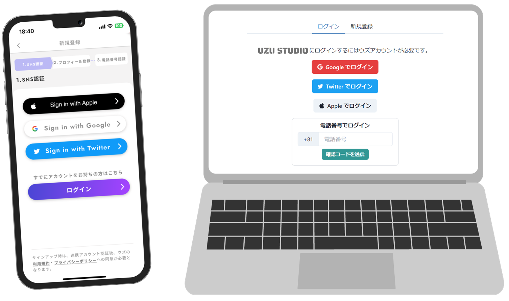

# ログイン方法

[アプリ「ウズ」](https://uzu.one/app/dl)でアカウントを作成してから、同じアカウントでウズスタジオにログインします。ウズのアカウントをお持ちでない方は、先にウズをダウンロードして、アカウントを作成してください。

「ウズ」で電話番号を登録している方が多いと思いますので、「**電話番号でログイン**」がおすすめです。

ウズスタジオへは[こちら](https://studio.uzu-app.com/)からアクセスできます。ブックマークしておくと便利です。\
利用認証に**Discordアカウント**が必要ですので、アカウントをお持ちでない方はそちらも合わせて作成してください。

ウズのアカウントに外部サービスを連携している場合は、それらの方法でログインすることもできます。

<figure><figcaption></figcaption></figure>
